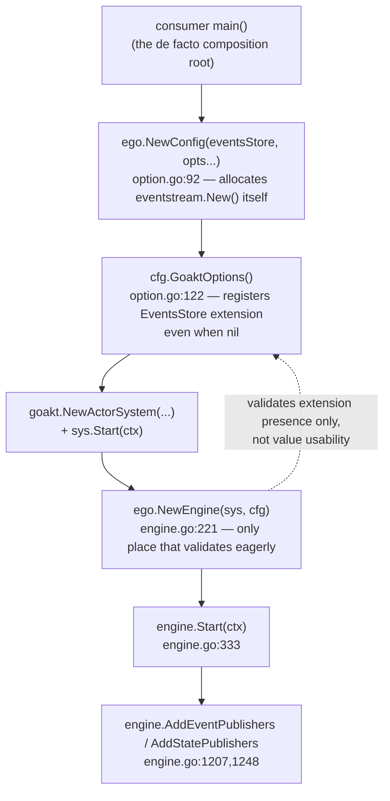
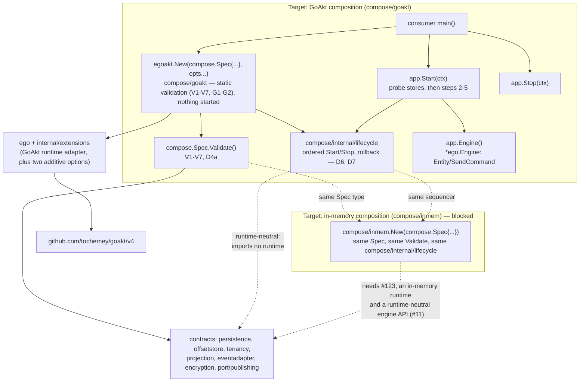

# Design — Composition root and dependency injection model (EGO-ARCH-003)

| Field | Value |
|---|---|
| Change | `ego-arch-003` |
| Date | 2026-09-26 |
| Phase | `sdd-design` |
| Inputs | [`proposal.md`](./proposal.md), [`openspec/changes/ego-arch-001/design.md`](../ego-arch-001/design.md) §4.1 |
| Baseline | `main` at `77beda6` |

## 1. Summary and vocabulary

A **composition root** is the one place in a program that builds concrete adapters and wires them into the application's contracts, so that everything else in the program receives already-built dependencies instead of constructing its own. Ego does not have one today: assembly is copy-pasted into every consumer's `main()` and into the fifteen inline call sites in `engine_test.go` (`rg -n "NewActorSystem" engine_test.go` finds them at, among others, lines 82, 90, 100, 116, 137, 155 and 934). This design gives Ego two composition roots — one for the GoAkt runtime it has today, one for an in-memory runtime that does not exist yet — built from the same runtime-neutral description of what to wire.

Terms used below, each defined once:

- **`Spec`** — a plain Go struct listing the already-constructed dependencies (stores, publishers, resolvers) and declarative settings (name, entity families used, shutdown timeout) that a composition root needs. It is not itself a composition root; it is the input to one.
- **Composition root** — here, one of `compose/goakt` or (future) `compose/inmem`: a package whose job is to validate a `Spec`, build the runtime-specific pieces, and expose a started `App` with deterministic `Start`/`Stop`.
- **Service locator** — an anti-pattern where code looks up a dependency by type or name from a shared container at the point of use, instead of receiving it as a parameter. This design forbids it explicitly (D2).
- **Entity family** — one of the three kinds of entity Ego supports: `EventSourcedBehavior`, `DurableStateBehavior`, `SagaBehavior`. Which families a deployment uses determines which stores are required (D3).
- **Static validation** — checks that need no I/O and no goroutines: type checks, presence checks, uniqueness checks. Runs inside `New`, before anything starts.
- **Probe validation** — checks that need I/O: pinging a configured store to confirm it is reachable. Runs at the start of `Start`, before anything else starts.
- **`extension.Dependency`** — a marker interface from `github.com/tochemey/goakt/v4/extension` (GoAkt module `v4.5.4`) requiring `MarshalBinary`/`UnmarshalBinary` (from `encoding.BinaryMarshaler`/`BinaryUnmarshaler`) and `ID() string`. GoAkt uses it to serialize values that ride along with an entity spawn for cluster placement. `EventSourcedBehavior`, `DurableStateBehavior` and `SagaBehavior` all embed it today, which is why a behavior written against Ego's own public contract cannot run on anything but GoAkt without also satisfying a GoAkt interface. `#123` adds runtime-neutral contracts for this in a new `port/behavior` package (`EventSourced`, `DurableState`, `Saga`) plus new `Engine.Spawn*` methods that accept them; the existing `ego` names keep embedding `extension.Dependency` — marked `Deprecated:` — until the major release `#124` introduces, per the "no break in v4" decision (ego-arch-001 §10). That is a prerequisite this design depends on but does not implement.

## 2. Composition root today

### 2.1 The five functions and their order

Source: `option.go` (`Config`, `NewConfig`, `GoaktOptions`) and `engine.go` (`Engine`, `NewEngine`, `Start`, `Stop`, `AddEventPublishers`).

1. **`NewConfig(eventsStore persistence.EventsStore, opts ...Option) *Config`** (`option.go:92-106`). Applies every `With*` option, then resolves the logger to `kitlog.L()` (a process-wide global) if none was set. It also allocates a concrete adapter itself: `eventStream: eventstream.New()` at `option.go:95`, with no `WithEventStream` option to override it. There is no validation here — a nil `eventsStore` is accepted silently, and a projection registered without a matching offset store is accepted silently, even though `WithOffsetStore`'s own doc comment (`option.go:246`) says an offset store is mandatory whenever `WithProjection` is used.
2. **`Config.GoaktOptions() []goakt.Option`** (`option.go:122-180`). Translates the `Config` into GoAkt extensions. The `EventsStore` extension is registered unconditionally (`option.go:130-133`), even when `c.eventsStore` is nil — this is the mechanism behind the fail-late panic described next.
3. **`goakt.NewActorSystem(name, cfg.GoaktOptions()...)`** and **`sys.Start(ctx)`** — called by the consumer directly against the GoAkt package, not through Ego.
4. **`NewEngine(actorSys goakt.ActorSystem, config *Config) (*Engine, error)`** (`engine.go:221-282`). This is the one function in the current path that validates eagerly: it rejects a nil actor system, a nil config, an actor system that is not yet running (`!actorSys.Running()`, so `NewEngine` never starts the actor system itself), more than one tenant resolver, and a set of registered extensions that does not match the `Config`'s optional fields (`validateActorSystemExtensions`, `engine.go:288-317`). That last check only proves the *extension slots* line up; it does not prove the values inside them are non-nil and usable, and it does not check that a projection has a paired offset store.
5. **`Engine.Start(ctx)`** (`engine.go:333-351`) sets the global OpenTelemetry propagator if telemetry is configured, then marks the engine started. It does not start the actor system (already required to be running) and does not start publishers or projections — those are separate calls the consumer makes afterward with `AddEventPublishers`/`AddStatePublishers` and `StartProjection`.

### 2.2 Two confirmed defects

**Fail-late instead of fail-fast.** `NewConfig(nil, ego.WithLogger(l))` — no events store — followed by `GoaktOptions()`, `goakt.NewActorSystem`, and `NewEngine` all succeed, because the `EventsStore` extension is present, it just wraps a nil interface. The failure surfaces only when the first `EventSourcedBehavior` is spawned: `event_sourced_actor.go:489` calls `entity.eventsStore.Ping(ctx.Context())` with no nil guard, two lines above where `snapshotStore` *is* guarded (`if entity.snapshotStore != nil { ... }`, `event_sourced_actor.go:491-493`). Calling a method on a nil Go interface value panics. This runs inside `PreStart`, which GoAkt drives through a `singleflight.Group`; that mechanism's own doc comment (`extension_lookup.go:31-49`) documents that a panic there "is deliberately re-panicked by singleflight on a fresh, unrecoverable goroutine ..., which crashes the whole process instead of just failing the one Spawn call" — so this nil-interface panic is not recovered, it crashes the process rather than merely failing the one `Entity` call. A related but better-behaved gap: `WithProjection` without `WithOffsetStore` also compiles and constructs cleanly, and fails only when `StartProjection` spawns the projection actor — `projection_actor.go:76` calls `requireExtension[*extensions.OffsetStore](...)`, which returns a descriptive error instead of panicking, because that path was deliberately hardened (comment at `extension_lookup.go:31-49`) after an earlier raw type-assertion panic used to crash the process.

**No rollback on Start, no complete cleanup on Stop.** `Engine.Stop` (`engine.go:368-403`) sets `engine.started.Store(false)` *before* any cleanup runs, then iterates configured publishers closing each one; if any `publisher.Close(ctx)` returns an error, `Stop` returns immediately (`engine.go:379-381`), skipping the rest of the events-publisher loop, the entire states-publisher loop, `eventStream.Close()`, and detaching the actor-system reference. Because `started` was already flipped to `false`, a retried `Stop(ctx)` call now short-circuits at the top and returns `nil` without ever finishing — the remaining publisher goroutines and the event stream are permanently leaked with no retry path. Every root-module example compounds this on the startup side: `example/eventssourced/main.go:63-72` calls `os.Exit(1)` if `NewEngine` fails, after `sys.Start(ctx)` already succeeded two lines earlier, leaking the started actor system; `example/eventssourced/main.go:75` and `example/durablestate/main.go:74` write `_ = engine.Start(ctx)`, discarding the only error `Start` can return; `example/saga/main.go` and `example/cluster/main.go` each call `os.Exit(1)` at several later points after `engine.Start` has already succeeded (for example `example/saga/main.go:132-222`), with no `engine.Stop`/`sys.Stop` on any of those paths.

### 2.3 Current graph



No box in this diagram validates the whole graph before something starts, and no box undoes a partial failure. `openspec/changes/ego-arch-001/design.md` §4.1 already reaches this same conclusion independently and explicitly defers "where the composition root should live, how it validates the graph, and who owns Start/Stop ordering" to this issue.

## 3. Decisions

### D1 — Location

Two new packages live in the root module: `compose` (runtime-neutral — the `Spec` struct, `Spec.Validate` and the `StartError` type) and `compose/goakt` (the GoAkt composition root — `New` and `App`). A future `compose/inmem` follows the same shape once its prerequisites (§5.2) are met. The sequencing logic both compositions share — probe, start steps in order, roll back on failure, stop in order — lives in `compose/internal/lifecycle`. Go's `internal` rule makes that package importable only from `compose/...`, so it is an implementation detail of `compose/goakt` (and later `compose/inmem`), never a public container consumers construct or hold, and it may use `compose`'s error types without breaking the `composition-leaf` rule (D8).

The package name `compose` is kept (reviewed in #125; `app` and `bootstrap` were the alternatives).

The existing manual path — `NewConfig`, `GoaktOptions`, `goakt.NewActorSystem`, `NewEngine`, `AddEventPublishers` — is unchanged and stays supported for v4 as the "advanced/manual composition" path, for consumers who need GoAkt options `compose/goakt` does not expose (custom remoting, discovery or supervision settings). `compose/goakt` is additive: new packages plus two additive `ego` options (D3, D5), no changed signature, no deprecation.

### D2 — Dependency injection model

Explicit constructor injection at the root only. `compose.Spec` (sketched in D3) is a plain struct of already-constructed instances, typed by the same contract packages the manual path already uses, plus declarative settings (a name, the entity families in use, a shutdown timeout). The consumer constructs every adapter; `compose` never instantiates a store or a publisher, and it does no auto-discovery of any kind — there is no scan for implementations, no tag-based registration, nothing resembling a plugin loader.

Below the root, each internal component receives only its own dependencies as constructor parameters — the same discipline `NewEngine` already applies to the `Engine` struct's fields, extended to cover the pieces that today are assembled ad hoc in the consumer's `main`. GoAkt's extension registry (`internal/extensions`, wired through `ego.GoaktOptions`) remains an internal detail of the GoAkt adapter; it is never reachable from `compose`, from contracts, or from application code.

This is checkable, not just a style preference. Forbidden, and checked by review and by the `composition-leaf` archcheck rule (D8): exported registry or container types anywhere, `compose/...` included; `Resolve`/`Get`-by-type functions; reflection-based wiring, meaning any use of `reflect` to find, construct or connect a dependency; passing a `Spec` value or a running `App` into any package under `ego`, `internal/extensions`, or a contract package. One use of `reflect` is explicitly allowed: V5's nil check (`reflect.ValueOf(v).IsNil()` on a value the consumer already placed in a named `Spec` field). It inspects a value; it does not wire anything.

Runtime-specific settings — telemetry (`*ego.Telemetry`), the `kitlog.Logger`, GoAkt cluster configuration and entity kinds, or an extra `goakt.Option` — belong to `compose/goakt`'s own option functions, not to the neutral `Spec`, because `Spec` must mean the same thing for every runtime; telemetry stays runtime-specific for now because `#31` has not yet defined a neutral observability contract.

### D3 — `Spec` and entity families

`Spec` declares which entity families a deployment uses, so that static validation (D4) knows which stores are required without waiting for the first spawn. The shape, as a sketch (field names are settled in IMPL-2; the semantics below are not):

```go
package compose

// Family is a bit set of the entity families a deployment runs.
type Family uint8

const (
	EventSourced Family = 1 << iota
	DurableState
	Saga
)

type Spec struct {
	Name     string // identifies the deployment; each runtime validates its own naming rules
	Families Family // at least one bit; zero is a validation error (V1)

	EventsStore   persistence.EventsStore
	StateStore    persistence.StateStore
	SnapshotStore persistence.SnapshotStore // optional
	OffsetStore   offsetstore.OffsetStore   // required iff Projections is non-empty

	Projections map[string]*projection.Options // key is the projection name, so names are unique by construction

	EventAdapters  []eventadapter.EventAdapter // optional
	Encryptor      encryption.Encryptor        // optional
	TenantResolver tenancy.TenantResolver      // optional; one field, so "more than one resolver" cannot be expressed

	EventPublishers []publishing.EventPublisher
	StatePublishers []publishing.StatePublisher

	ShutdownTimeout time.Duration // bounds rollback and Stop (D6, D7); zero means the default
}
```

`Families` has no implicit member: `Families: compose.DurableState` means durable state only, and a zero value is rejected rather than defaulted, so nothing about the deployment is guessed. Every projection in `Projections` is started by `App.Start`; there is no separate autostart list.

The engine must know the declared families to reject a spawn of an undeclared one (D4). `compose/goakt` passes them through a new additive `ego` option (first of the two `ego` options this design adds). A spawn of an undeclared family then returns a typed error instead of panicking or silently succeeding; the check itself lives inside the unexported `spawnEventSourced`/`spawnDurableState`/`spawnSaga` functions that `#123`'s S3-2 slice introduces (§5.2, §6 IMPL-4), not in the public `Entity`/`DurableStateEntity`/`Saga` methods or the new `SpawnEventSourced`/`SpawnDurableState`/`SpawnSaga` methods, so every entry point enforces it through the same one copy.

### D4 — Validation, in two phases

**(a) Static, before anything starts — no I/O, no goroutines.** Validation returns one error that lists every problem found, built with `errors.Join` over typed errors that each name the offending field, rather than stopping at the first one. It has two parts.

`compose.Spec.Validate()` — runtime-neutral, imports no runtime:

- **V1** — `Families` is non-zero.
- **V2** — `EventSourced` or `Saga` declared, or `Projections` non-empty ⇒ `EventsStore` must be non-nil.
- **V3** — `DurableState` declared ⇒ `StateStore` must be non-nil.
- **V4** — `Projections` non-empty ⇒ `OffsetStore` must be non-nil, and every entry must have a non-nil `*projection.Options` with a non-nil `Handler`.
- **V5** — a typed-nil interface value is rejected wherever a literal `nil` would be, not just a literal `nil` — the same class of bug behind the `eventsStore.Ping` panic in §2.2, caught here instead of at first spawn. The typed-nil check covers every interface-typed field and element, optional ones included (`SnapshotStore`, `Encryptor`, `TenantResolver`, each `EventAdapters` element): leaving an optional field out (a literal `nil`) is allowed, but a typed nil passes the runtime's own `!= nil` guards and panics on first use, so it is rejected. A literal `nil` `EventAdapters` element is also reported under V5 (maintainer decision, 2026-09-27, #135).
- **V6** — every configured publisher is non-nil, and publisher IDs are unique per kind (events, states). `AddEventPublishers`/`AddStatePublishers` key publishers by `ID()` (`engine.go:1228`, `engine.go:1269`), so a duplicate overwrites the first entry and orphans its `sendEvent`/`sendState` goroutine; `Stop` never closes it.
- **V7** — `ShutdownTimeout` is not negative (maintainer decision 2026-09-27, #145).

No tenant-resolver rule is needed: `NewEngine` rejects more than one resolver (`ErrAmbiguousTenantResolver`, `engine.go:80`, checked at `engine.go:240-242`) because `WithTenantResolver` can be called repeatedly (`option.go:435`), but `Spec` has a single `TenantResolver` field, so that state cannot be built.

`compose/goakt.New` — GoAkt-specific, runs after `Spec.Validate`:

- **G1** — when `WithCluster` is used, at least one entity kind is supplied. `compose/goakt` registers `ClusterKinds()` with the cluster configuration and passes the entity kinds to `ego.WithBehaviorKinds` (added by `#123`'s S3-4, `option.go`); the deprecated `ego.WithEntityKinds` (`option.go:359`) remains available on the manual path. Without kinds, spawns placed on a remote node cannot rebuild the behavior.
- **G2** — `Spec.Name` is a valid GoAkt actor-system name.

**(b) Probe, at the first step of `Start`, before anything else starts.** Every configured store's `Ping(ctx)` is called; the store contracts already expose it (`persistence/events_store.go:112`, `persistence/state_store.go:75-81`, `persistence/snapshot_store.go:65-71`, `offsetstore/offset_store.go:34-38`), so this reuses an existing method rather than inventing a new one. A failure names the store that failed.

Separately, and independently of `compose`, `#126` (slice IMPL-1) makes the manual path safe too: `Engine.Entity` and `Engine.Saga` return a new `ErrEventsStoreRequired` instead of reaching the unguarded `Ping` (`event_sourced_actor.go:489`, `saga_actor.go:186`), matching the guard `Engine.DurableStateEntity` already has (`engine.go:902`), and duplicate publisher IDs are rejected at `AddEventPublishers`/`AddStatePublishers`.

### D5 — Ownership

Who constructs, connects, and closes each dependency needs to be unambiguous, because §2.2 showed what happens when it is not (the caller-owned actor system being left running, or a store connection nobody closes).

| Dependency | Constructed by | Started/connected by | Stopped/closed by |
|---|---|---|---|
| Stores (events, state, offset, snapshot) | Consumer | Consumer (before `New`) | Consumer (after `Stop` returns) — `App` only pings them; a caller-owned resource is never closed implicitly (`#24`'s stated principle) |
| Actor system | `App` (`compose/goakt`) | `App`, step 2 of `Start` | `App`, in `Stop` or in rollback |
| Engine | `App` | `App`, step 3 | `App`, in `Stop` or in rollback |
| Event stream | `App`, step 2 of `Start`, handed to the config through a new additive `ego.WithEventStream` option (the second `ego` option) — today `NewConfig` allocates it internally with no override (`option.go:95`) | — | `App`: by `engine.Stop` once the engine exists; directly by rollback if `Start` fails before step 3 |
| Publishers | Consumer | `App` attaches them at step 4 | `App`. Ownership transfers when `New` succeeds. After that, `App` closes every publisher it received on every terminal path: `Stop`, a failed `Start` (attached ones through `engine.Stop`, unattached ones directly), and `Stop` on an `App` that was never started |
| Projections | Declared in `Spec` | `App`, step 5 | `App`, in `Stop` or in rollback |
| Telemetry provider, logger | Consumer | — (used, not started) | Consumer |

Transferring publisher ownership at `New`, rather than at attachment, keeps the rule simple for the consumer: once `New` returns without error, the consumer never closes a publisher it passed in. The consumer's only obligation is to call `Stop` on every `App` whose `New` succeeded, whether or not `Start` was called or succeeded.

The manual composition path keeps today's semantics unchanged: the consumer still owns the actor system directly.

### D6 — Start order and rollback

`App.Start(ctx)` runs five steps in order. On failure at step *k*, it undoes steps *k*−1 down to 1 in reverse, then closes every publisher that step 4 had not attached yet, collecting every rollback error rather than stopping at the first one. It returns a `*compose.StartError{Step string, Err error, Rollback error}` that names which step failed and what, if anything, went wrong undoing the earlier ones. This directly answers `#24`'s "startup failure identifies the responsible component."

| Step | Action | Undo on later failure |
|---|---|---|
| 1 | Probe every configured store (D4b) | Nothing to undo |
| 2 | Allocate the event stream, build `ego.Config` (`WithEventStream`, families, `Spec` fields) and GoAkt options, create and start the actor system | `sys.Stop`, then close the event stream — the engine that would close it does not exist yet |
| 3 | `NewEngine` + `engine.Start` | `engine.Stop`, which from here on also closes the event stream; step 2's undo then only stops the actor system |
| 4 | Attach publishers | Attached publishers: closed by step 3's `engine.Stop`. Publishers not yet attached: closed directly |
| 5 | Start every projection in `Spec.Projections` | Stop each projection that was actually started |
| — | Any failure at steps 1–5 | After the undos, close every publisher that was never attached (D5) |

`App` is single-use, moving through the states `New → Starting → Running → Stopping → Stopped`, plus a terminal `Failed`; calling `Start` again after `Failed` or `Stopped` returns an error rather than silently retrying, and `Start`/`Stop` are serialized by a mutex so concurrent callers cannot interleave them. `Stop` on a `Failed` `App` is a no-op, because rollback already released everything.

**Context for cleanup.** Rollback and `Stop` use the same cleanup context: `context.WithoutCancel(ctx)` bounded by `Spec.ShutdownTimeout` (default suggested as 30s, left open in §9). Values from the caller's context are kept, but its cancellation is not. Both paths need this for the same reason: `Start` often fails because the caller's `ctx` was cancelled, and `Stop` is usually called from a signal handler whose `ctx` is already done; in either case, cleanup that inherited the cancellation would abort immediately and leak everything this design exists to release. The timeout, not the caller, bounds how long cleanup may take.

### D7 — Stop order

`App.Stop(ctx)` runs four steps under the cleanup context defined in D6. Unlike today's `Engine.Stop`, every step is attempted even if an earlier one fails; the resulting errors are joined rather than the first one short-circuiting the rest, which is exactly the fix for the leak in §2.2.

1. Mark the app stopping, so a concurrent `Start` or second `Stop` cannot interleave.
2. Stop the projections that `Start` started. This must happen before step 3: `Engine.StopProjection` returns `ErrEngineNotStarted` once the engine is stopped (`engine.go:508-515`).
3. `engine.Stop(ctx)` — sets `started` to `false` first, so from here on new commands get `ErrEngineNotStarted`; then closes publishers and the event stream.
4. Stop the actor system.

Command admission therefore closes at step 3, not at step 1: while projections stop, callers holding `app.Engine()` can still send commands. `App` hands out the `*ego.Engine` itself, so it cannot gate admission earlier without an engine-level admission switch. That switch is `#24`'s `LIFE-003` ("stop accepting new commands"); this design records the gap and does not add a second, `App`-level gate that the engine could bypass.

`Stop` is idempotent. On an `App` that was never started, it only closes the publishers it received (D5). One question is recorded rather than resolved here: events or state an actor emits while it is shutting down (durable-state actors persist their final state on shutdown, per `behavior.go`'s doc comment) could be dropped, because publishers close in step 3 before the actor system stops in step 4. This design adds a test for it in IMPL-4 (§6) to make the behavior observable, but the flush/drain policy itself belongs to `#24` (its `LIFE-004` item), not to this change. `Engine.Start`'s global OpenTelemetry propagator side effect (§2.1, step 5) is left as-is and documented as a known process-wide effect for `#31` to address.

### D8 — Architecture check

Two new rules in `internal/cmd/archcheck` (`internal/cmd/archcheck/rules/rules.go`), alongside the four existing rules (`contract-allowlist`, `application-no-runtime`, `external-adapter-no-runtime`, `no-cross-module-internal`):

- A new rule, `composition-no-runtime`, with its own layer covering `compose` and `compose/internal/lifecycle`: they must not import `ego`, `internal/extensions`, or `github.com/tochemey/goakt/v4` — the same denylist as `application-no-runtime`. That existing rule is not widened: its layer (`ApplicationLayer`, `internal/cmd/archcheck/rules/layers.go:99-110`) matches only `migration`, and ego-arch-001 §3 defines it as the Application-layer rule. `compose` is part of the composition root, not the Application layer, so it gets its own layer and rule; `application-no-runtime` and ego-arch-001 stay unchanged, and a violation in `compose` reports the composition layer by name. `compose` starts with no baselined exception. Its `Rule.Source` field (`internal/cmd/archcheck/rules/rules.go:122-182`) cites this document — `ego-arch-003/design.md §D8` — rather than the existing four rules' `"design.md §3"`, which points at ego-arch-001 and has no composition layer to describe.
- A new rule, `composition-leaf`: a root-module production package may import `compose` or anything under `compose/` only if it is itself under `compose/` (for example `compose/goakt` importing `compose` and `compose/internal/lifecycle`) or is a `main` package. Test files, examples and `benchmark` are consumers and stay free to import it. `compose/goakt` is classified as a composition root, so — symmetrically with the GoAkt runtime adapter layer — it may import anything it needs (contracts, `egopb`, `ego`, GoAkt, `compose/internal/lifecycle`). Determining whether an importing package is `main` needs the package's own name, which today's `Package` struct (`internal/cmd/archcheck/rules/graph.go:68-79`) does not carry — only `ImportPath`, `Kind` and `Imports` — so IMPL-2 (§6) adds a new package-name field to `rules.Package` (`internal/cmd/archcheck/rules/graph.go`) and a loader change in `internal/cmd/archcheck/loader.go`, where `rules.Package` values are built (`loader.go:106` for the root module, `loader.go:316` for nested modules), to populate it.

## 4. Target graph



The import alias `egoakt` avoids a name clash with the `goakt` module import itself in consumer code, the same way `kitlog` avoids clashing with the standard `log` package in existing examples.

## 5. Walkthroughs

Both walkthroughs use the same starting point — a consumer wiring up an event-sourced deployment — so the difference between "works today" and "blocked" is visible step by step.

### 5.1 GoAkt composition

**Today** (`example/eventssourced/main.go`), five steps, two confirmed leaks:

```go
eventStore := testkit.NewEventsStore()
_ = eventStore.Connect(ctx)
cfg := ego.NewConfig(eventStore, ego.WithLogger(logger))
sys, err := goakt.NewActorSystem("Sample", cfg.GoaktOptions()...)
if err != nil { os.Exit(1) }               // nothing started yet — fine
if err := sys.Start(ctx); err != nil { os.Exit(1) }   // sys not started — fine
engine, err := ego.NewEngine(sys, cfg)
if err != nil { os.Exit(1) }               // LEAK 1: sys is already running, never stopped
_ = engine.Start(ctx)                       // LEAK 2: the one error Start can return is discarded
```

(`example/eventssourced/main.go:49-75`.) Shutdown is symmetric but manual: the consumer calls `eventStore.Disconnect(ctx)`, then `engine.Stop(ctx)`, then `sys.Stop(ctx)`, in that order, with a comment explaining why (`// stop ego first, then the actor system (the caller owns its lifecycle)`, line 112) — correct, but only because this example got it right; nothing enforces the order for a consumer who does not.

**Target**, using `compose/goakt` (aliased `egoakt` to avoid clashing with the `goakt` module import):

```go
eventStore := testkit.NewEventsStore()
if err := eventStore.Connect(ctx); err != nil { /* handle */ }
defer eventStore.Disconnect(ctx) // consumer owns the store (D5); runs after app.Stop

app, err := egoakt.New(compose.Spec{
    Name:        "Sample",
    Families:    compose.EventSourced,
    EventsStore: eventStore,
}, egoakt.WithLogger(logger))
if err != nil {
    // static validation failed (D4a) — nothing was started, nothing to undo
}
defer app.Stop(ctx) // required once New succeeded (D5); idempotent; a no-op after a failed Start

if err := app.Start(ctx); err != nil {
    // *compose.StartError names the failed step; rollback already ran (D6)
}

if err := app.Engine().SpawnEventSourced(ctx, behavior); err != nil { /* ... */ }
// ... app.Engine().SendCommand(...) as today ...
```

`New` performs only static validation (D4a): building the value costs nothing and starts nothing, so a configuration mistake is visible before any goroutine or connection exists. `Start` is the only place I/O happens, and it happens in the fixed order of D6. The walkthrough calls `SpawnEventSourced`, the neutral entry point `#123`'s S3-3 slice adds (`ego-arch-002-s3` §5.4); the deprecated `Entity` method keeps working unchanged for callers who have not migrated, consistent with `ego-arch-002-s3` §12's note that this design's walkthrough calls `SpawnEventSourced`.

Cluster deployments add `egoakt.WithCluster(clusterConfig, kinds ...ego.BehaviorKind)`, where `kinds` are behavior prototypes — the standard-library-only replacement `#123`'s S3-4 adds for the values `ego.WithEntityKinds` takes today (`option.go:359`); a single `EntityKind` value is assignable to `BehaviorKind` because the two share the same method set, so a caller migrating one prototype at a time from the manual path passes it unchanged, and the deprecated `WithEntityKinds` shape remains available for that manual path. A caller that holds its prototypes as a `[]ego.EntityKind` slice cannot spread it directly into the variadic `...ego.BehaviorKind` parameter — Go does not convert a slice's element type across a variadic call even when each element is individually assignable — so that caller converts the slice element by element before calling `WithCluster`. A cluster deployment needs two registrations. `ClusterKinds()` goes on the GoAkt cluster configuration, which `example/cluster/main.go:152` does by hand (`WithKinds(ego.ClusterKinds()...)`). The behavior types go through `WithBehaviorKinds`, whose doc comment (mirroring `WithEntityKinds`'s at `option.go:340-358`) allows omitting it only for single-node deployments, because a remote node rebuilds a behavior from its registered type. `example/cluster` does not pass `WithEntityKinds` today; IMPL-4 checks whether its remote spawns work only because they happen to stay local. `WithCluster` does both registrations, and G1 rejects a cluster configuration with no entity kinds at `New`, instead of leaving it to the first remote spawn.

### 5.2 In-memory composition — where it stops today

The point of designing `compose/inmem` alongside `compose/goakt` is that the same `Spec`, the same `Spec.Validate` and the same `compose/internal/lifecycle` sequencer carry over unchanged; only the runtime steps differ. The criterion in `#105` is stronger than that, though: the **domain and the consumer code that drives it** must run on both compositions without change. `Spec` itself carries no behaviors — in §5.1 they reach the runtime through `app.Engine().SpawnEventSourced(ctx, behavior)` — so the blockers are on that path, not in `Spec`. Three are true on `main` at `77beda6`:

1. **The behavior type requires GoAkt.** `Engine.Entity` takes an `ego.EventSourcedBehavior` (`engine.go:645`), and that interface embeds `extension.Dependency` (`behavior.go:48`; also `behavior.go:100` and `saga.go:42` for the other two families). Any consumer code that declares or passes a behavior is written against a GoAkt interface, and the domain author implements `MarshalBinary`/`UnmarshalBinary`/`ID` with no cluster to serialize for. This is `#123`'s scope: it adds runtime-neutral contracts in a new `port/behavior` package (`EventSourced`, `DurableState`, `Saga`) and new `Engine.SpawnEventSourced`/`SpawnDurableState`/`SpawnSaga` methods that accept them; the existing `ego.EventSourcedBehavior`/`DurableStateBehavior`/`SagaBehavior` names keep embedding `extension.Dependency` — marked `Deprecated:` — until the major release `#124` introduces, per the "no break in v4" decision (ego-arch-001 §10), so the GoAkt requirement stays inside the adapter without an apidiff-incompatible break. `#123`'s S3-2 slice adds this bridge at the spawn call sites that already build `[]extension.Dependency{behavior, ...}` at `engine.go:692`, `925`, `1326` and pass it to `Spawn`/`SpawnOn` at `699`, `932`, `1332` (verified on `77beda6`), where ego-arch-001 §3 permits a GoAkt reference; that same slice renames `Engine.Entity`, `Engine.DurableStateEntity`, and `Engine.Saga`'s bodies in place into unexported `spawnEventSourced`/`spawnDurableState`/`spawnSaga` functions, with both the deprecated public methods and the new `Spawn*` methods delegating to them. IMPL-4 (§6) adds a declared-entity-family guard inside those same three unexported functions — not the public methods — at those same spawn call sites, so the old and new entry points both enforce it with one copy, and the two changes touch identical lines mechanically. `#123`'s S3-2 (spawn-site bridge) and S3-4 (kind registration) slices land first, and IMPL-4 rebases onto both. (The names `port/behavior`, `Spawn*`, `BehaviorKind`/`WithBehaviorKinds` and `BehaviorPlacementError` were confirmed by the maintainer on 2026-09-27, as defined in `ego-arch-002-s3`'s design.)
2. **There is no in-memory runtime.** The only engine is `*ego.Engine`, bound to `goakt.ActorSystem` throughout `engine.go`; no `Entity`/`SendCommand`/`Dispatch` implementation exists without GoAkt. `testkit/scenario.go:40-54` comes closest: it declares narrower structural interfaces without `extension.Dependency` ("because the testkit cannot import ego") and calls `HandleCommand`/`HandleEvent` directly. That proves the command/event functions are runtime-agnostic, but a direct call is not a runtime: it has no dispatch, persistence, publishers or supervision, and nothing for `compose/inmem` to start or stop.
3. **There is no runtime-neutral engine API.** `App.Engine()` in §5.1 returns `*ego.Engine`, a concrete GoAkt-backed type. Even after (1) and (2), consumer code written as `app.Engine().Entity(...)` / `SendCommand(...)` against `compose/goakt` would not compile against `compose/inmem`, because `compose/inmem` cannot return an `*ego.Engine`. "The same domain, two runtimes" needs an interface for the operations consumers call — spawning entities, sending and dispatching commands, starting and stopping projections — that both runtimes implement. That interface is the application-facing side of `#11`'s runtime service provider interface (SPI) (its `RUNTIME-001` and `RUNTIME-002` items: runtime SPI, runtime-neutral entity references and invocation). Neither `#123` nor an in-memory runtime supplies it, so without naming it here the in-memory half would stall again after `#123` lands.

Until (3) exists, `compose/goakt.App.Engine()` returns `*ego.Engine` as designed; when `#11` defines the neutral interface, `App` gains an accessor for it (additive), and `compose/inmem` exposes the same accessor. Once all three are resolved, `compose/inmem.New(spec)` runs the identical `spec.Validate()`, drives the identical `compose/internal/lifecycle` sequencer, and differs from `compose/goakt` only in step 2 of D6 (build an in-memory runtime instead of a GoAkt actor system) and step 4 of D7 (stop that runtime instead of `sys.Stop`). That is the concrete, checkable meaning of "the same domain, two runtimes" in `#105`.

**A reading to rule out explicitly:** running GoAkt with in-memory *stores* (`testkit`'s `EventsStore`/`StateStore`/etc., which already exist and already work today) is not the same thing and does not satisfy this criterion — that is still the GoAkt runtime, just backed by fakes instead of a real database. The criterion is about the *runtime* (the thing that spawns entities, delivers commands, supervises failure), not the stores behind it.

## 6. Implementation plan

Each row is its own pull request, sized as one reviewable work unit; later rows depend on earlier ones only where stated.

| Slice | Content | Depends on | Tests / verification |
|---|---|---|---|
| IMPL-1 ([`#126`](https://github.com/getsyntegrity/ego/issues/126)) | Bugfix, independent, can land immediately: `Engine.Stop` attempts every shutdown step and joins errors instead of returning on the first failure; `Engine.Entity`/`Engine.Saga` return typed `ErrEventsStoreRequired` instead of reaching the unguarded `Ping`; `AddEventPublishers`/`AddStatePublishers` reject a duplicate publisher ID. | Nothing | Each test fails on `main` first: the first publisher's `Close` fails and later publishers and the event stream still close; `Entity`/`Saga` return an error, not a panic, with no events store; a duplicate ID is rejected and no goroutine is left behind. |
| IMPL-2 | `compose.Spec`, `Spec.Validate` and `StartError` (D3, D4a); the `composition-no-runtime` and `composition-leaf` rules in archcheck (D8); a new package-name field on `rules.Package` (`internal/cmd/archcheck/rules/graph.go:68-79`, which today carries only `ImportPath`, `Kind` and `Imports`) plus a loader change in `internal/cmd/archcheck/loader.go` (where `rules.Package` values are built, `loader.go:106` and `loader.go:316`) to populate it, so `composition-leaf` can tell a `main` package apart from others. | Nothing | One test per rule V1–V6 with everything else valid; one test with several problems at once asserting the joined error lists all of them; typed-nil values (V5) for each interface field; duplicate publisher IDs per kind (V6); archcheck tests asserting that `composition-no-runtime` rejects `compose` and `compose/internal/lifecycle` importing `ego`/`internal/extensions`/GoAkt and that `application-no-runtime` still matches only `migration`, and that a non-`main` production package outside `compose/` cannot import `compose` or anything under it. |
| IMPL-3 | `compose/internal/lifecycle`, the ordered sequencer, tested against fake steps rather than real GoAkt (D6, D7). | IMPL-2 (returns `compose.StartError`) | Ordered-start test with fakes; a failure injected at each step rolls back exactly the steps already started, in reverse, then releases the not-yet-attached resources; best-effort stop order with a failure at each step still runs the rest; cleanup runs under `WithoutCancel` plus the timeout even when the caller's context is already cancelled; single-use state transitions (`New → Starting → Running → Stopping → Stopped/Failed`); `Stop` is idempotent. |
| IMPL-4 | `compose/goakt`: `New`, `App`, `WithCluster(cfg, kinds ...ego.BehaviorKind)` (the deprecated `EntityKind`/`WithEntityKinds` shape remains available on the manual path) and the other options (D1, D2, D5, D6, D7, G1, G2); the two additive `ego` options (declared families, `WithEventStream`). | IMPL-2, IMPL-3; lands after `#123`'s S3-2 (spawn-site bridge) and S3-4 (kind registration), both of which edit the same `engine.go`/`option.go` regions IMPL-4 also touches: S3-2 renames `Engine.Entity`/`Engine.DurableStateEntity`/`Engine.Saga`'s bodies in place into unexported `spawnEventSourced`/`spawnDurableState`/`spawnSaga` functions at the spawn call sites that build `[]extension.Dependency{...}` at `692`, `925`, `1326` and pass it to `Spawn`/`SpawnOn` at `699`, `932`, `1332` (verified on `77beda6`) — exactly where IMPL-4's declared-entity-family guard lands; S3-4 adds `ego.BehaviorKind`/`WithBehaviorKinds` in `option.go`, which `WithCluster` needs. `#123`'s S3-2 and S3-4 must both land first, and IMPL-4 rebases onto them. `ego-arch-002-s3`'s own design (§9) orders S3-4 after S3-2 *and* S3-3 — S3-3 owns the shared test file `engine_neutral_cluster_test.go` that S3-4 adds a subtest to — so IMPL-4 transitively also waits on S3-3, even though IMPL-4 never touches that file directly. | End-to-end wiring test with `testkit` stores (valid `Spec` all the way to a running engine); a missing required dependency fails at `New` with nothing started; a startup failure injected at each of the five `Start` steps leaves no running actor system, a closed event stream and every publisher closed; `Stop` on a never-started `App` closes its publishers; spawning an undeclared family returns the typed error; shutdown order is recorded and matches D7; `Stop` after `Stop` is a no-op; a cluster `Spec` without entity kinds fails G1; a test that reproduces the D7 open question (does an event emitted during actor shutdown survive) and records the observed answer, without deciding the policy. |
| IMPL-5 | Migrate `example/eventssourced` (and its doc reference) to `compose/goakt`; other examples migrate only if useful, not required by this change. | IMPL-4 | The migrated example builds, runs, and shuts down cleanly with no `os.Exit` before cleanup; the two leaks in §2.2/§5.1 no longer reproduce. |
| IMPL-6 | `compose/inmem` and the neutral engine accessor on both `App`s. | `#123`; the in-memory runtime (§9); the runtime-neutral engine API from `#11` (§5.2, blocker 3) | Not yet specifiable in detail; will reuse IMPL-2/IMPL-3 test shapes and add one test that runs the same behavior value, through the same consumer code, on both compositions. |

## 7. Acceptance mapping

Mapping `#105`'s stated acceptance criteria to the slice that delivers it and the concrete check that proves it:

| `#105` criterion | Slice | Verification |
|---|---|---|
| Explicit, documented composition root | IMPL-4 (and this design) | `compose/goakt` package exists with godoc; this document is the record of the decision. |
| Core/application do not instantiate concrete adapters | IMPL-2, IMPL-4 | The existing `contract-allowlist` and `application-no-runtime` rules keep contracts and `migration` from importing adapters, so they cannot construct one; IMPL-2 adds `composition-no-runtime`, which applies the same denylist to `compose` and `compose/internal/lifecycle`. `compose.Spec` holds only caller-constructed instances. In the composed path the event stream is allocated by `compose/goakt` (the composition root) and handed in through `ego.WithEventStream`; the manual path keeps `NewConfig`'s `eventstream.New()`, which sits in the GoAkt adapter layer, not in core. |
| An invalid graph fails at construction, not at first command | IMPL-2, IMPL-4 | V1–V7 unit tests (V1–V6 in IMPL-2, V7 in IMPL-4) and G1–G2 tests in IMPL-4; the typed-nil case (V5) specifically targets the `Ping`-panic class of bug from §2.2. |
| Deterministic Start/Stop order with rollback on partial failure | IMPL-3, IMPL-4 | Ordered-fakes tests in IMPL-3; the five-step injected-failure tests in IMPL-4, including publisher and event-stream release. |
| Tests cover valid wiring, missing dependency, startup failure, and shutdown | IMPL-2, IMPL-3, IMPL-4 | The test columns of those three rows, combined. |
| At least one GoAkt composition and one in-memory composition without changing the domain | IMPL-4 (GoAkt half); IMPL-6 (in-memory half, blocked) | IMPL-4's end-to-end test proves the GoAkt half. The in-memory half is **not** met until IMPL-6 runs the same behavior value, through the same consumer code, on `compose/inmem` with the same `Spec`; a design that only claims neutrality does not satisfy it. `#105` therefore stays open until IMPL-6 lands, or until maintainers explicitly split this criterion into a follow-up issue. |
| No generic constructor passed through all layers as a covert service locator | IMPL-2, IMPL-4 | D2's forbidden list, checked in review and by `composition-leaf`; no `Resolve`/`Get`-by-type function exists anywhere in `compose`. |

## 8. Alternatives rejected

- **A generic DI container or framework** (for example `uber/fx`, `dig`, or a hand-rolled registry). Rejected: out of scope per `#105` ("choosing a mandatory DI framework" is excluded), it hides the dependency graph behind reflection instead of making it a plain struct literal, and a container is itself a service locator once anything looks a dependency up by type at the point of use.
- **Code generation** (for example `google/wire`). Rejected: Ego's composition graph is small — a handful of stores, publishers, and settings — and a generator adds a build step and a generated-file convention for a graph that a plain constructor already expresses clearly.
- **Composition inside package `ego`** (an `ego.Assemble` function). Rejected: package `ego` **is** the GoAkt adapter (§2, and ego-arch-001 §4's classification), and `#11` intends to split it behind a runtime SPI. A composition root that lived inside the GoAkt adapter could never select a different runtime — it would already be committed to one.
- **Keep consumer `main` as the root, add only validation helpers.** Rejected: this is close to what exists today, and §2.2's leaks are the direct evidence that leaving ordering and rollback to every consumer goes wrong in practice — four examples in this repository alone get some part of it wrong.
- **Make `NewEngine` own and start the actor system itself.** Rejected: this would break the documented v4 contract that the caller owns the actor system's lifecycle (`engine.go:211-213`, `353-360`), which downstream consumers may already depend on for things like sharing one actor system across other, non-Ego actors.
- **Functional options for `Spec`, instead of a struct.** Rejected: options apply one at a time, in call order, which makes it impossible to validate the whole set at once or to inspect what was configured after the fact — exactly the two properties D4's static validation needs.
- **Transfer publisher ownership only when a publisher is attached** (the other option for D5). Rejected: the consumer would then own publishers after a failed `Start` but not after a successful one, and would need to know which step failed to know what to close. Transferring at `New` gives one rule: after `New` succeeds, always call `Stop`, never close a publisher yourself.
- **An `App`-level command admission gate** in front of the engine. Rejected: `App.Engine()` returns the engine itself, so callers could bypass the gate; admission belongs in the engine (`#24`, `LIFE-003`).
- **Build the in-memory composition now, on top of GoAkt-coupled behaviors and `*ego.Engine`.** Rejected: this is the architectural block documented in §5.2, not a design choice — consumer code typed against `ego.EventSourcedBehavior` and `*ego.Engine` is GoAkt code, whichever runtime executes it.

## 9. Open decisions

| Decision | Why it is open | Who closes it |
|---|---|---|
| Default shutdown timeout for cleanup (`context.WithoutCancel` bound, D6/D7) | No measurement exists yet for how long store/publisher/actor-system teardown typically takes; 30s is a starting suggestion, not a measured value. | Implementer, together with `#24` |
| Owner of the in-memory runtime prerequisite | Recommendation from the #125 review: a child issue under `#11` for its `RUNTIME-005` ("deterministic in-memory runtime"), not a reopened `#103` — `#103` is about contracts, the runtime belongs with `#11`, and the neutral engine API (§5.2, blocker 3) lands there too. Not created yet. | Maintainers, when `#11` is broken down |
| Owner of the runtime-neutral engine API (§5.2, blocker 3) | Falls inside `#11`'s `RUNTIME-001`/`RUNTIME-002`; `#11` has no child issues yet. | `#11` |
| Deprecation of the manual composition path | The manual path (`NewConfig`/`GoaktOptions`/`NewEngine`) stays supported for v4 regardless; whether it is ever marked `Deprecated:` once `compose/goakt` covers the same ground is not decided here. | A later ADR, once `compose/goakt` has real usage to compare against |
| Whether consumers may later hand stores over as owned by `App` | D5 keeps stores consumer-owned throughout. A future option to transfer ownership (`#24`, `LIFE-006`) is not ruled out, but is not designed here. | `#24` |
| Flush/drain policy for events or state emitted during actor-system shutdown (D7) | This design records the risk and adds a test to observe current behavior (IMPL-4), but the policy itself is `#24`'s (`LIFE-004`). | `#24` |
| Relationship with `#35` (typed configuration) | `compose.Spec` is an in-code Go shape built by the consumer's own code; binding it from environment variables or a config file is a distinct concern `#35` owns. | `#35` |
| Relationship with `#106` (adapter SPI) | `compose/internal/lifecycle` stays internal to `compose/...` until `#106` defines what a public adapter lifecycle looks like; promoting it to a public API before then would risk designing it twice. | `#106` |
