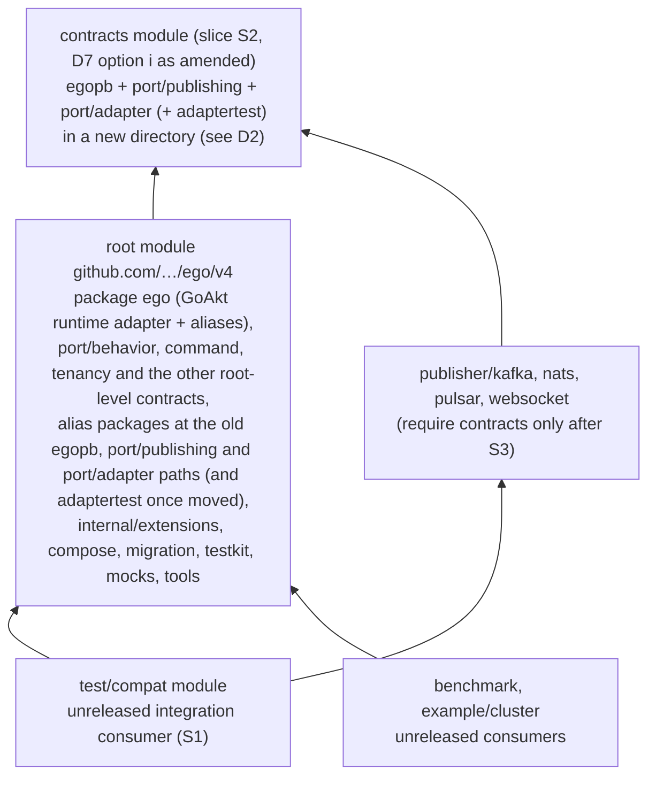

# Design — Physical Go modules and impact-aware CI (EGO-ARCH-006)

| Field | Value |
|---|---|
| Change | `ego-arch-006` |
| Date | 2026-09-27 |
| Phase | `sdd-design` |
| Tracker | [`#102`](https://github.com/getsyntegrity/ego/issues/102), parent [`#10`](https://github.com/getsyntegrity/ego/issues/10), CI owner [`#38`](https://github.com/getsyntegrity/ego/issues/38) |
| Inputs | [`exploration.md`](./exploration.md), [`proposal.md`](./proposal.md), ego-arch-001 [`design.md`](../ego-arch-001/design.md) §3, §4, §6, §7, §8, §10 |
| Baseline | `main` at `77beda6b91646b0e031ce78401ee997fd919bd65` |

## 1. Summary

The CI selector learns to work on **modules** instead of on "the root plus satellites". It reads each module's `go.mod`, builds the graph of which in-repository module requires which, and selects every module that transitively depends on a changed one, with a written reason for each. That lands first and needs no human decision.

After that, Wave 3 adds modules one per pull request, in this order:

1. an unreleased integration-test module that takes the publisher compatibility checks out of the publishers;
2. one **contracts** module holding `egopb`, `port/publishing` and `port/adapter` (with `port/adapter/adaptertest`): the root packages the publishers import, production and tests (decision D7 as amended on 2026-09-28, see "D7 amendment");
3. the four publishers switched to require the contracts module instead of the root.

`port/behavior` (#131) does **not** go into the contracts module under the recommendation. It imports `command`, which imports `tenancy`, and both stay in the root. Moving `port/behavior` alone would make the contracts module require the root while the root requires it: a module cycle that ego-arch-001 §3 forbids, and one that would put GoAkt back into the publishers' graph. It waits for F1 unless the maintainers choose D7 (ii).

The payoff, measured in exploration §4.2, is that the publishers' requirement lists lose GoAkt and Olric: 173 GoAkt edges and 35 Olric edges in each `go mod graph` today. On the CI side, a change confined to the root runtime no longer selects the publishers.

The design is honest about the limit. A contract change will still reach the root package `ego`, whose tests take about 8.5 minutes (exploration §7), so modules do not shorten contract-change feedback; #112 owns that.

Slices 2 and 3 create module paths that consumers must resolve. Exploration §5 showed that a nested module under `github.com/pablogore/ego/v4/<dir>` placed in directory `<dir>` cannot be resolved at all. Those slices therefore wait for maintainer decisions (§3):

- module identity, nested-module path and layout, and the first published version;
- the contents of the contracts module;
- whether ego-arch-001 §6(1) and §6(4) are met by gating on a release pipeline, or amended.

## 2. Target module map

### 2.1 Graph after Wave 3

Arrows mean "requires" in `go.mod`, resolved from the working tree through `replace` for integrated verification (ego-arch-001 §8).



Before Wave 3, every nested module requires the root and nothing else (exploration §3). No arrow ever points from `contracts` back to the root, and that is the invariant D7 protects.

### 2.2 Each boundary against ego-arch-001 §6

ego-arch-001 §6 promotes a package set to a module only when all five points hold: (1) the rules check passes for it, (2) a real benefit that a package cannot deliver, (3) CI discovers and verifies it, (4) it can be released, (5) no hidden coupling (no module cycle, no cross-module `internal/` import).

| Order | Boundary | (1) Rules | (2) Benefit a package cannot give | (3) CI | (4) Release | (5) Coupling | Verdict |
|---|---|---|---|---|---|---|---|
| S1 | `test/compat`: publisher/`ego` alias and sentinel checks (from #130) | new nested module; imports root `ego` like `benchmark` | lets S3 remove the root requirement from the publishers, which #122 asks for, without a module cycle | S0 selector plus existing `modules` job | never released, like `benchmark` | requires root plus publishers; nothing requires it | **Go**, given decision D5 |
| S2 | contracts: `egopb` + `port/publishing` + `port/adapter` (+ `adaptertest`) (D7 option i as amended) | schema and contract allowlist; `port/publishing` imports only `egopb` and the standard library (exploration §4.1); `port/adapter` imports only the standard library (D7 amendment) | publishers (and future store adapters) require contracts without GoAkt, Olric or OTel in their module graph: the §6(2) example itself | yes | needs D1–D3, plus a release pipeline (F4) or the D8 amendment | requires only protobuf; no import of root | **Conditional**: D1–D3, D7, D8 |
| S3 | the four publishers require the contracts module instead of the root | `external-adapter-no-runtime` already holds | measured: 173 GoAkt and 35 Olric edges leave each publisher's `go mod graph` | yes | publisher releases no longer wait on a root release | none | **Conditional**: after S2 |
| — | a separate schema module (`egopb` alone) | yes | **none on its own**: its only effect is letting a port module avoid requiring the root, and putting `egopb` in the same contracts module achieves that too | — | — | — | **No**, fails §6(2) (rejected in D7) |
| — | `port/behavior` in the contracts module without `command` and `tenancy` | — | — | — | — | **cycle**: `port/behavior` imports `command` (`port/behavior/behavior.go`, `saga.go` on PR #131), which imports `tenancy`; both stay in the root, so contracts would require root while root requires contracts | **No**, breaks §6(5) and ego-arch-001 §3 |
| F1 | root-level contracts (`persistence`, `offsetstore`, `tenancy`, `command`, `projection`, `eventstream`, `encryption`, `eventadapter`) and `port/behavior` | yes | only once an external module needs them without GoAkt (a store adapter, or an in-memory runtime from #11). None exists yet | — | — | `eventstream` must take `internal/queue` and `internal/syncmap` with it | **Wait**: move at the #124 major, or earlier when such a module exists |
| F2 | `testkit` + `persistence/conformance` | test support | lets store adapters run conformance without the root | — | — | root tests import `testkit`: needs F1 first, or it is a cycle | **Wait** for F1 |
| F3 | GoAkt runtime adapter (`ego`, `internal/extensions`, `compose/goakt`) | runtime adapter | independent runtime cadence (#11) | — | — | needs the runtime SPI (#11) and #105 | **Wait** for #11 and #124 |
| — | tools (`internal/cmd/*`) | tooling | none today: standard library only (exploration §4.1) | — | — | — | **No**, fails §6(2) |
| — | `migration` | application | none: it needs the runtime | — | — | — | **No**, fails §6(2) |

Why there is no "leaf" production module first. #102's delivery plan suggests a leaf module as the first cut, but no production package qualifies under §6: the only leaves are tooling and `migration`, and neither delivers a §6(2) benefit. The publishers are already leaf modules. S1 is the leaf that validates the pipeline: a new module, the repository's first nested-to-nested edge, and the reverse-transitive selector on real code. It needs no module-path decision because nothing outside the repository ever resolves it.

### 2.3 What stays in the root module until #124

Package `ego` (the engine, actors, options, telemetry and every compatibility alias), `internal/extensions`, all other `internal/*`, `compose` and `compose/goakt` (#125), `migration`, `port/behavior` (#131), the eight root-level contracts (unless a store adapter or an in-memory runtime pulls F1 earlier), the alias packages left at the old `egopb`, `port/publishing` and `port/adapter` paths, plus `port/adapter/adaptertest` once S2 moves it (D2, D7 amendment), `testkit`, `persistence/conformance`, `mocks/*`, `test/data/testpb`, the three root examples and `internal/cmd/*`. #124 then removes the root's Go files and the aliases in a major release; that is the natural point for F1 to F3, because the import paths change anyway.

## 3. Decisions for the maintainers

The design did not choose these. **The maintainers approved them on 2026-09-27:** D2–D7 as recommended, D8 option (C), and D1's direction, "migrate the module path before the first release", subject to explicit confirmation of the target path and migration plan below before anything is executed. They guide S2 and S3. Each row names the slices it blocks.

| # | Decision | Blocks | Recommendation | Status (2026-09-27) |
|---|---|---|---|---|
| D1 | Module identity | S2, S3 | Decide before S2; if moving, move before the first release | **Approved direction**: migrate before the first release. Execution waits for maintainer confirmation of the target path and plan below |
| D2 | Nested-module path, layout and versioning | S2, S3, publisher consumability | (a) suffix-less paths with independent v0/v1 versions | **Approved** (a) |
| D3 | First published version and release order | S2 consumability, release | Topological order (amends ego-arch-001 §8 item 1) | **Approved**: topological order, §8 item 1 amended |
| D4 | `go.work` policy | F5 only | W2, generated and not committed | **Approved** W2 |
| D5 | Unreleased integration-consumer modules | S1 | Yes, bounded | **Approved** |
| D6 | Reading of §6(2) against #102 | none (confirmation) | Keep §6(2) | **Approved** |
| D7 | Contents of the contracts module(s) | S2, S3 | (i) `egopb` + `port/publishing` in one module | **Approved** (i); **amended 2026-09-28**: also `port/adapter`, and `port/adapter/adaptertest` once its own tests stop importing root packages (see "D7 amendment") |
| D8 | Meeting §6(1) and §6(4) before any release exists | S2, S3 | (C) gate on F4, amend §6(1) only | **Approved** (C): S2 and S3 stay gated on F4; only §6(1) is amended |

### D1 — Module identity

The question is whether to keep `github.com/pablogore/ego/v4` or move to a `getsyntegrity` path (#39 REL-002).

- **(a) Keep.** No import churn now. But the repository lives at `getsyntegrity/ego` and resolves by redirect (exploration §5), and #39 wants to move away from that identity.
- **(b) Move before S2.** One import-path migration for consumers. No release exists (zero tags), so no *tagged* version breaks. The root does already resolve by pseudo-version (exploration §5), so anyone who depends on a commit still sees the change. Every new module is born under the final path.
- **(c) Move at #124.** This batches the path break with the root-layout break, but every module that S2 and S3 create gets migrated twice.

**Recommendation:** decide before S2. If a move is planned at all, (b) is the cheapest.

### D2 — Nested-module path, layout and versioning (new, exploration §5)

Go's major-version rule constrains every option here. A module path that does **not** end in `/vN` (N ≥ 2) can only carry v0 or v1 versions. To tag `port/v4.2.0`, the path must end in `/v4` (for example `…/ego/port/v4`); the `go.mod` then sits in `port/` or in `port/v4/`, and the tag is `port/v4.2.0`.

- **(a) Suffix-less paths, independent v0/v1 versions.** Paths look like `github.com/<owner>/ego/contracts` and `…/ego/publisher/kafka`, tagged `<dir>/v0.x.y` or `<dir>/v1.x.y`.
  - For: each module has its own release cadence, one of the §6(2) benefits. It matches `release.yml`, which already numbers publishers from `0.0.0` (`release.yml:116-141`).
  - Against: a v0 number signals instability to consumers, and a later breaking change needs a `/v2` path.
- **(a') Lockstep `/v4` suffix for nested modules.** Paths look like `…/ego/contracts/v4` and `…/ego/publisher/kafka/v4`, tagged `<dir>/v4.x.y`, with version numbers that follow the root's.
  - For: one number across the repository.
  - Against: every root major forces every nested module onto a new path, even when it did not change. There is no independent cadence.
- **(b) Physical `v4/<dir>` directory.** Example: `v4/port/go.mod` with path `github.com/<owner>/ego/v4/port`.
  - For: import paths stay exactly as they are.
  - Against: it is unproven here. It must never create `v4/go.mod`, or Go would take `v4/` as the root module. Carving a package out under the same import path risks Go's ambiguous-import error for consumers whose root version still contains the package.
- **(c) No nested module that the root requires until #124.** S2 and S3 move to the #124 major, and Wave 3 is only S0 and S1.

**Directory consequence of (a) and (a').** A package cannot keep its old import path in the same directory once that directory holds its own `go.mod`. The root can no longer serve `…/v4/egopb` from `egopb/`, because `egopb/` now belongs to the new module. So the new module lives in a **new directory** (for example `contracts/`), and the old directories stay in the root as alias packages until #124.

**Recommendation:** (a), for independent cadence and because it matches the numbering `release.yml` already uses. It also makes today's publishers consumable.

### D3 — First published version and release order

Nested modules require the unpublished `v4.4.3` (exploration §3). Once the root requires the contracts module, a release must be **topological**: contracts first, then the root, then the publishers. This **amends ego-arch-001 §8, policy item 1** ("the root module is released first"), and `release.yml` implements the old order today (`release.yml:12-24`). The number itself (`v4.4.3`, or a fresh number under a new identity) belongs to #39 REL-005.

**Recommendation:** decide the number after D1, and adopt the topological order through the explicit §8 amendment (follow-up F4).

### D4 — `go.work` policy

See §4: **W1** committed plus a drift check, **W2** generated on demand and not committed, **W3** none.

**Recommendation:** W2.

### D5 — Unreleased integration-consumer modules

The question is whether a *new* module may skip §6(2) and §6(4), as `benchmark` and `example/cluster` already do.

- **Yes, bounded.** Allowed only when no released module requires it, and when `docs/ci.md` lists it as unreleased.
- **No.** Then the #130 compat checks stay tag-gated inside the publishers, and S3 cannot drop the root requirement without losing that check.

**Recommendation:** yes, bounded.

### D6 — Reading of §6(2) against #102

#102 says boundaries must also be compilation boundaries. §6(2) says faster compilation alone does not qualify. Exploration §7 shows that modules do not shorten contract-change feedback, because the root package dominates.

**Recommendation:** keep §6(2). Justify every module by module-graph pruning, a toolchain difference or release cadence, never by CI speed alone.

### D7 — Contents of the contracts module(s)

At exploration time the publishers imported exactly two root packages, `egopb` and `port/publishing` (exploration §4.2); since #158 `publisher/websocket` also imports `port/adapter` (see "D7 amendment"). `port/behavior` (PR #131) imports `command`, which imports `tenancy`.

- **(i) One module holding `egopb` and `port/publishing`.** `port/behavior` waits for F1. Nothing inside the module imports the root, and the §6(2) benefit is exactly the publishers' pruning.
- **(ii) One module that also holds `port/behavior`, `command` and `tenancy`.** It needs aliases at the old `command` and `tenancy` paths, and it moves two root-level contracts ahead of F1. Against §6(2), no module needs `command` or `tenancy` without GoAkt today; that would only change if an in-memory runtime module (#11 RUNTIME-005) needed behavior contracts outside the root. It is also a larger, riskier slice.
- **(iii) Two modules, a schema module (`egopb`) and a port module.** Rejected: the schema module alone fails §6(2). Its only effect is letting the port module avoid requiring the root, and option (i) achieves that with one module and one release unit fewer.
- **Also rejected:** a module holding `port/behavior` while `command` stays in the root. It would require the root while the root requires it: a cycle forbidden by ego-arch-001 §3 and §6(5), and one that brings GoAkt back into the publishers' module graph.

**Recommendation:** (i).

### D7 amendment (approved 2026-09-28)

**Why.** Option (i) rested on "the publishers import exactly two root packages". That stopped being true when #106 spec 2 (#158) made `publisher/websocket` an adapter-SPI adopter: `publisher/websocket/websocket.go:34` imports `port/adapter` in production. Under (i) as written, S3 could remove the root requirement from only three of the four publishers. Measured on `main` `8b3962a` (#159 diagnosis).

**What changes.** The contracts module also holds `port/adapter`. It imports only the standard library (`context`, `reflect`, `slices`), so it adds no dependency to the module and no path back to the root. `port/behavior` still waits for F1; nothing else in D7 changes.

**`port/adapter/adaptertest`: included, with a precondition.** It was not added by anticipation; the import map shows tests that need it outside the root: `publisher/websocket/conformance_test.go:31` and `port/publishing/publishingtest/unreachable_internal_test.go:31`. A module's requirements cover its tests' imports, so without `adaptertest` in the contracts module `publisher/websocket` would keep requiring the root for its tests. Its production code imports only `port/adapter`, the standard library and `testing`. But two of its own test files import root packages: `port/adapter/adaptertest/implied_internal_test.go:28-29` (`offsetstore`, `persistence`) and `port/adapter/adaptertest/adaptertest_test.go:37` (`persistence`). Moved as they are, the contracts module would require the root while the root requires it: a cycle forbidden by ego-arch-001 §3 and §6(5). So S2 first moves those test cases to the root side, next to the packages they exercise, and only then moves `adaptertest`. If that relocation is not possible without losing coverage, `adaptertest` stays in the root, and **S3 is blocked**: the slice records the impediment (which test cases, why they cannot move, what would unblock them) and is not considered done. S3's goal is all four publishers requiring the contracts module only, production and tests; three out of four does not meet it.

**Rejected.** Leaving `port/adapter` in the root: `publisher/websocket` would keep GoAkt and Olric in its module graph, which is exactly the benefit §6(2) credits to S2 and S3. Adding `adaptertest` unconditionally: it would create the cycle above.

### D8 — Meeting §6(1) and §6(4) before any release exists

§6(1) requires the rules check to have passed "for at least one release", and none exists. §6(4) requires a published-version verification job, which is F4 and outside Wave 3. S2 and S3 cannot satisfy either today.

- **(A) Gate S2 and S3 on F4 and on a first release.** This follows the ADR literally. But the first release then happens before the module split, and the publishers stay unconsumable until D2 is applied in that release.
- **(B) Amend §6.** §6(1) would count `main` builds instead of a release. §6(4) would require the verification job before a module's first *release*, not before it is *created*.
- **(C) Hybrid.** Gate S2 on F4 (the job exists and is exercised on a pseudo-version), and amend only §6(1): "archcheck passed on every `main` build since #117 with no baseline entry for the candidate packages".

**Recommendation:** (C). §6(4) protects consumers and should stay a hard gate. §6(1)'s "one release" cannot be satisfied when no release exists, and archcheck has enforced the rules on every `main` build since #117.

### D1 target path and migration plan (proposal, pending maintainer confirmation before execution)

**Status:** the maintainers approved the direction ("migrate the module path before the first release") on 2026-09-27. **Nothing in this subsection may be executed until a maintainer explicitly confirms the target paths and this plan.** It is a proposal, not a decision.

**Proposed target paths.** They are consistent with D2 (a): the root keeps its major suffix, and nested modules are suffix-less with their own v0/v1 versions.

| Module (directory) | Today | Proposed target |
|---|---|---|
| root (`.`) | `github.com/pablogore/ego/v4` | `github.com/getsyntegrity/ego/v4` |
| contracts (new directory, S2) | — | `github.com/getsyntegrity/ego/contracts` |
| `publisher/kafka`, `nats`, `pulsar`, `websocket` | `github.com/pablogore/ego/v4/publisher/<name>` | `github.com/getsyntegrity/ego/publisher/<name>` |
| `benchmark`, `example/cluster`, `test/compat` (unreleased) | `github.com/pablogore/ego/v4/<dir>` | `github.com/getsyntegrity/ego/<dir>` |

Why these paths:

- The root keeps `/v4` so the major version keeps meaning "the v4 API line". #124's later break then becomes `/v5`.
- The rejected alternative is restarting the root at v0/v1 under the new path. It would have no suffix, but it would signal a new, unstable API.
- Exploration §5 probed the old path, `github.com/pablogore/ego/v4`, which resolves by pseudo-version through the proxy. The target path does **not** resolve yet: `go get github.com/getsyntegrity/ego/v4@77beda6b9164` fails with `module declares its path as: github.com/pablogore/ego/v4`. That is expected until the migration commit changes the `module` line, and the verification step below must show it succeeding afterwards. A suffix-less nested path does find its directory: `github.com/pablogore/ego/publisher/kafka` located `publisher/kafka/go.mod` and failed only on the declared path.

**What changes, in one mechanical pull request.** A half-renamed tree does not build, so this is one unit. It will exceed the ~400-line planning heuristic. At the baseline, `rg --hidden 'pablogore/ego'` outside `openspec/`, `odd/` and `vendor/` finds 162 files and 535 occurrences. Hidden paths such as `.github/workflows/release.yml` count, and plain `rg` skips them.

- **`go.mod` module lines** of all seven modules, plus the nested modules' `require` and `replace` lines that name the root.
- **Every import in the repository**, including generated code: the `go_package` options in `protos/ego/ego.proto:7` and `protos/test/test.proto:5`, regenerated with `buf`; mocks, regenerated; examples; `benchmark`.
- **Documentation:** `readme.md`, `docs/ci.md`, `CHANGELOG.md`, `SECURITY.md`, `example/cluster/README.md`. Historical `openspec/` and `odd/` records stay as written.
- **CI and release:**
  - `release.yml:90` and `:146`;
  - `scripts/ci/verify-published.sh:35`;
  - the tag scheme of D2, which becomes `publisher/<name>/v0.x.y`, owned by F4.
- **Tooling that assumes the path:** `internal/cmd/archcheck` (`baseline.go`, `loader.go`, `main.go`, `rules/graph.go` and their tests) and `internal/cmd/ciselect` (`main.go`, `selector/graph.go`), wherever the path is written literally, in code or in comments, rather than read from `go.mod`. Also `benchmark/Makefile:21` and `:25`, whose `go mod edit -replace` and `-dropreplace` name the root path.
- **The four publishers' `closure_test.go`** (from #130), which hard-codes the root path at line 71 of `publisher/kafka/closure_test.go`.
- **Out of scope:** `github.com/pablogore/kit-logger` is a separate module, owned by #39 REL-007. The `@pablogore` owner handles in `.github/` are not module paths.

**Ordering:**

- after S0 and S1, which do not depend on the path;
- **before S2**, so the contracts module is born under its final path;
- before F4 publishes anything;
- well before #124, which later moves the root to `/v5`.

No `// Deprecated:` notice is planned on the old path. Go reads that notice from the old path's `@latest`. With no tags, `@latest` is the default-branch head, which after the migration declares the new path, so the notice would never be seen. Making it visible would need a tag on a deprecation commit under the old path. Tags are shared by both paths in this repository, so that tag would also appear in the new path's version list, where it would be invalid, because that commit declares the old path. The migration guide (#39 REL-006) carries the notice instead.

**Consumer impact.** No tags exist, so no *tagged* version breaks. Consumers pinned to a root pseudo-version under the old path keep building, because the proxy keeps serving those commits. To upgrade, they must rewrite their imports: a module path cannot alias another module path. The migration guide belongs to #39 REL-006. The publishers have no consumers, because they could never be resolved (exploration §5).

**Verification before merge:**

- `GOWORK=off go build ./...` and `go vet ./...` in every module;
- archcheck and the full CI gate;
- `rg --hidden 'pablogore/ego'` (hidden files included) finds only historical records;
- from a scratch consumer module, `go get` at the migration branch head's pseudo-version, through the proxy and again with `GOPROXY=direct`, for the root and one publisher. This is the exploration §5 method, and it must now succeed where it failed.

**Rollback.** Before any tag exists, revert the single migration PR. Anyone who already adopted the new path at a pseudo-version would break, so do it only if it is found early. After the first tag under the new path there is no rollback: a return would be yet another path change.

**Why this is not a stop condition.** #102's goals and ego-arch-001 §6 can both be met. §2.2 shows each proposed module passing §6 once D7 and D8 are settled. The open decisions fit as options, each with a safe default: without D1–D3, D7 and D8, Wave 3 still delivers S0 and S1, which are the selector, the first leaf module and the pipeline validation. The only #102 criterion that stays unmet until then is "the relevant hexagonal boundaries are real modules".

## 4. `go.work` policy

Facts (exploration §8): no `go.work` is committed. A root `go.work` breaks the root lane's `go mod vendor` and `-mod=vendor` listing unless `GOWORK=off` is set. `go work init` pins the local toolchain in the file's `go` line. The nested-module scripts already force `GOWORK=off`.

Rules that hold under every option:

- **Verification never runs in workspace mode.** Every CI step that builds, vets, lints, tests or selects sets `GOWORK=off`. S0 adds that to `ciselect`'s own `go` subprocesses. A workspace can satisfy an import that a module's `go.mod` does not require, which is exactly the "hidden publishable incompatibility" #102 warns about.
- **Integrated verification uses `replace`.** Each nested module keeps a local `replace` for every in-repository module it requires, so it builds with `GOWORK=off`. Go ignores these in a dependency, so consumers are unaffected (ego-arch-001 §8).
- **Published verification uses neither.** `verify-published.sh` drops the replaces and resolves real versions. It must be generalized from "publisher against the root" to "any released module against the published versions of everything it requires" (follow-up F4).
- **`go.work` and `go.work.sum` are global paths** for the selector (§5.3), whether or not they are committed.

Options for D4:

- **W1: committed.** CI checks that the file lists exactly the modules the selector discovers, and it carries no `go` line newer than CI's toolchain. The file is visible, and it matches #102's literal wording "the repository has a reproducible `go.work`". The cost: every workflow job needs `GOWORK=off`, including the root lane, which today would break without it; `go.work.sum` churns; and the toolchain line has to be maintained.
- **W2: generated, not committed** (recommended). `scripts/dev/gowork.sh` (not under `scripts/ci/`) runs `go work init` plus `go work use` for every module the selector discovers. `go.work*` is added to `.gitignore`. The file is reproducible from discovery and never goes stale, and CI cannot depend on it. The cost: developers run one command, and the gopls multi-module view is opt-in.
- **W3: none.** This is the status quo. It fails #102's criterion.

## 5. Selector design (`internal/cmd/ciselect`)

### 5.1 Module model

Discovery keeps today's `findSatelliteDirs` walk (`main.go:290-319`) and adds the root. For each module directory, `ciselect` runs `go mod edit -json` (no network, no build, part of the toolchain) and reads `Module.Path`, `Require[]` and `Replace[]`. That avoids a new dependency such as `golang.org/x/mod` in the published root `go.mod`.

The pure `selector` package gets:

```go
// ModuleInfo is one discovered Go module. All fields come from its go.mod
// (go mod edit -json) and from parsing its files; nothing is hand-listed.
type ModuleInfo struct {
	Dir     string   // repo-relative, forward slashes; "." for the root
	Path    string   // module path from go.mod
	Deps    []string // in-repo module paths it requires AND resolves from the
	                 // working tree (a replace to a local directory)
	Pinned  []string // in-repo module paths it requires at a published
	                 // version with no local replace; reported, never edges
	Imports []string // in-repo import paths found by go/parser (all files,
	                 // tests included, build tags ignored: #111's
	                 // discoverModuleImports), used for the import filter
	                 // (§5.2 step 5) and root-lane seeding
}
```

**Why `go.mod` requirements and not imports decide module edges.** A requirement changes a module's build even when no package imports anything from it, because minimal version selection reads the required module's own `go.mod`. Requirements are therefore the safe edge. Imports are finer, but they are wrong in both directions: they miss that case, and a parser that ignores build tags over-counts. Imports are therefore a *filter* on a requirement edge, never an edge by themselves (§5.2, step 5).

**When the import filter is sound.** Minimal version selection reads a required module D's `go.mod`, and `go.sum` only records checksums. So if D's `go.mod` and `go.sum` are unchanged, D contributes exactly the same build list to a consumer M as before. The only way a change in D can then reach M is through D's package code, and package code reaches M only through M's imports, direct or through another module M also imports. The requirement edge can therefore be narrowed to "M imports an affected package of D" **exactly when D's manifest is unchanged and D is not fully changed**. When D's `go.mod` or `go.sum` changed, D had a boundary change, or D's lane is `full`, the unfiltered requirement edge applies.

**The import set must be parser-based.** It must include tests and ignore build tags, as #111's `discoverModuleImports` does (`main.go:381-425`). A build-tagged importer, like #130's `//go:build compat` files, would otherwise be missed. The field exists from S0, and S2 must not start without it: S2 moves packages whose importers include such files.

**`replace` applies only in the main module.** When `it` is built, `adapter/a`'s own `replace` of `port` is ignored, so `it` compiles against the working-tree `port` only if `it` has its own local `replace` for it. A transitive chain `it ← adapter/a ← port` is therefore real at `HEAD` only when every consumer along it carries its own local `replace`. The selector does not check this: it walks the chain anyway, which may over-select. Over-selection is the safe direction. Nested modules that need to test against the working tree must list local `replace`s for their whole in-repository closure.

**Why pinned requirements are not edges.** A module that requires an in-repository module at a published version, with no `replace`, does not compile against the working tree, so a change there cannot break it at `HEAD`. The published-verification job (F4) owns that case, and the summary names such a module as "pinned to vX.Y.Z; not affected at HEAD".

### 5.2 Algorithm

1. **Global check.** If any changed path is global (§5.3), select every module, set the root lane to `full`, and record the reason. Stop.
2. **Ownership.** Each changed file belongs to the module with the longest `Dir` prefix (its nearest `go.mod`). Files owned by the root go through today's root classifier unchanged (package / no-test / full-fallback / unknown), so the package-level fast lane keeps working. Any file in a nested module marks that module changed. That is conservative on purpose: a nested module is always verified whole with `./...`.
3. **Boundary change.** A nested `go.mod` that was **added or deleted** (it exists at exactly one of base and head) marks its parent module (the module that owns the directory when that `go.mod` is absent) as fully changed, with the reason "module boundary changed". An added `go.mod` also marks its own new module changed. This closes gap 3 of exploration §6: carving a directory out of the root sends the root lane to `full`. An **edited** nested `go.mod` (it exists at both) has no boundary effect: it marks that module changed with its **manifest changed**, so its dependents follow through the unfiltered requirement edge (step 5).
   - *Mechanism.* `ciselect` gains an optional `-base <rev>` flag. For each changed nested `go.mod`, it checks existence at head (the filesystem) and at base (`git cat-file -e <rev>:<path>`). The base must be the **merge base** of the PR's base and head, `git merge-base "$BASE_SHA" "$HEAD_SHA"`, because the changed-file list comes from the three-dot diff `$BASE_SHA...$HEAD_SHA` (`pull_request.yml:56`), which compares against that merge base, not against `pull_request.base.sha` itself. `BASE_SHA` and `HEAD_SHA` are set only in the "Determine changed files" step's `env` (`pull_request.yml:52-54`), so the merge base must be computed where they are available. Two equivalent wirings exist:
     - add the same `env` entries to the "Select packages" step and compute the merge base there;
     - compute it in "Determine changed files" and hand it over through a file.

     Either is acceptable. The S0 implementation (PR #133) uses the file hand-off: `git merge-base "$BASE_SHA" "$HEAD_SHA" > "$RUNNER_TEMP/base.txt"` next to the changed-file list, then `-base "$(cat "$RUNNER_TEMP/base.txt")"` in "Select packages". The checkout already uses `fetch-depth: 0`. This is a small change to `pull_request.yml`, not a one-liner, and S0 includes it. Without `-base` (local runs, `build.yml`'s `-all`), every changed nested `go.mod` is treated as a boundary change, which is the conservative behavior.
4. **Changed set.** C is every nested module marked changed, plus the root when its lane is not `none`. Each member records whether its manifest changed (`go.mod` or `go.sum` edited, or a boundary change) and its **affected packages**: every package of a nested module, which is conservative because nested modules are verified whole; and, for the root, the packages #111's root lane selects (`root.Selected`).
5. **Reverse-transitive closure with the import filter.** A breadth-first walk over the reversed `Deps` edges starting from C, in sorted order so the output is deterministic. A consumer M of a reached module D is selected:
   - **unfiltered** when D's manifest changed, D is fully changed, or D is the root with lane `full`;
   - **otherwise only if** M's `Imports` name one of D's affected packages.

   A selected nested module then counts all its packages as affected for the next hop. For the root, this reproduces #111's accepted rule exactly: when the root lane is `affected` and the root manifest is unchanged, a nested module is selected only if it imports an affected root package. The walk records the first chain for each selected module, for example `test/compat ← publisher/kafka ← contracts`.
6. **Root-lane seeding through a dependency.** When the root is reached only because a module D it requires changed, the root lane's seed is the root packages whose `Imports`, `TestImports` or `XTestImports` name a package of D. The existing package closure (`graph.go:177-219`) runs from there. If D's `go.mod` or `go.sum` changed, the root lane runs `full`.
   - *Fixed point.* Steps 5 and 6 repeat until the root lane stops changing. When the root is reached only through a dependency, its lane is `none` on the first pass. Seeding can widen it, and a wider root lane can widen the walk from the root. Both the root lane and the selected-module set only grow, so the loop ends. The implementation bounds it by the number of modules as a defensive limit.
7. **Fail closed.** A `go mod edit` error or an unreadable `go.mod` makes `ciselect` exit non-zero, and the workflow then reruns it with `-all` (`pull_request.yml:63-68`). There is no "unowned" path: the root module's directory is the repository root, so every path belongs to some module. A file under a directory the discovery walk skips (`odd/`, `.codegraph/`, and so on) belongs to the root and goes through the root classifier. That classifier's existing `unknown` rule (`classify.go:181-183`) sends anything it cannot place to the full suite.

Module cycles are forbidden by ego-arch-001 §3, but the selector does not enforce that. A failure there would only trigger the `-all` fallback and a green run. The check belongs in archcheck (slice S1, rule `no-module-cycle`), where it fails the build.

### 5.3 Global paths

These force the full gate for every module: `go.work`, `go.work.sum`, `.golangci.yml`, `Makefile`, `Dockerfile.ci`, `buf.yaml`, `buf.gen.yaml`, and everything under `.github/`, `scripts/ci/`, `internal/cmd/ciselect/` and `protos/`.

Two paths are deliberately **not** global: the root `go.mod` and `go.sum`. They mark the root module as fully changed, and the closure then selects every module that requires the root. Today that is every module, so nothing changes. After S3, a root dependency bump stops selecting the publishers, which do not require the root any more.

### 5.4 Outputs

- `modules.json`: unchanged shape, a JSON array of nested module directories and `[]` when there are none, so `pull_request.yml` and `build.yml` need no change.
- `plan.json` (new): the portable plan #102 asks to be reusable by Shipwright. Shipwright is the portable pipeline #38 plans to move CI onto (CI-008), so that the plan does not depend on GitHub Actions. It holds `{global, reasons[], root: {mode, selected[]}, modules: [{dir, path, selected, reason, chain[]}]}` and lists **every** discovered module, selected or not, each with its reason. A module that requires a reached module but fails the import filter is listed as not selected, with the reason "not affected: requires `<dir>` but imports none of its affected packages".
- `summary.md`: adds a table with one row per module ("module | selected | why"). `verify-module.sh` already appends the commands it ran to the job summary (`verify-module.sh:106-118`).

### 5.5 Fixtures for #102's required test cases

Fixture repository (in-memory `ModuleInfo`, pure package test, no filesystem):

| Dir | Path | Deps (local) | Pinned | Imports (parser) |
|---|---|---|---|---|
| `.` | `example.com/r` | `example.com/r/port` | — | root package `example.com/r` imports `example.com/r/port`; root package `example.com/r/util` imports nothing and nothing imports it |
| `port` | `example.com/r/port` | — | — | — |
| `adapter/a` | `example.com/r/adapter/a` | `example.com/r/port` | — | `example.com/r/port` |
| `adapter/b` | `example.com/r/adapter/b` | `example.com/r` | — | `example.com/r` |
| `it` | `example.com/r/it` | `example.com/r/adapter/a`, `example.com/r/port` (its own local `replace` for each) | — | `example.com/r/adapter/a` |
| `tools` | `example.com/r/tools` | — | — | — |
| `pinned` | `example.com/r/pinned` | — | `example.com/r/port@v0.3.0` | `example.com/r/port` |
| `adapter/c` | `example.com/r/adapter/c` | `example.com/r/port` | — | `example.com/r/port` (present only in the "new module" case) |

| Case (#102) | Changed files | Expected modules | Expected root lane | Expected reasons |
|---|---|---|---|---|
| **Leaf** | `tools/main.go` | `tools` | `none` | `tools`: changed files |
| **Shared contract** | `port/p.go` | `port`, `.`, `adapter/a`, `adapter/b`, `it` | `affected`, seeded from root packages importing `example.com/r/port` (so `example.com/r` is selected; `util` is not) | `adapter/b`: `adapter/b ← . ← port`, passing the import filter because it imports `example.com/r`; `pinned`: not selected, "pinned to v0.3.0" |
| **Transitive consumer** | `adapter/a/a.go` | `adapter/a`, `it` | `none` | `it`: `it ← adapter/a` |
| **New module** (with `-base`: `adapter/c/go.mod` absent at base) | `adapter/c/go.mod`, `adapter/c/c.go` | `adapter/c`, `.`, `adapter/b` | `full` | `adapter/c`: changed files; `.`: "module boundary changed: adapter/c/go.mod"; `adapter/b`: `adapter/b ← .` (unfiltered, root lane is `full`) |
| **Global change** | `go.work` (and separately `.github/workflows/x.yml`) | all 7 (8 with `adapter/c`) | `full` | "global: go.work changed" |

Additional cases:

- docs only (`docs/x.md`) selects nothing;
- **manifest edit vs add vs delete** (all with `-base`):
  - *edit* `adapter/a/go.mod`, present at base and head: selects `adapter/a` and `it` through the unfiltered edge. There is no boundary effect, so the root lane stays `none`.
  - *add*: the "new module" case above.
  - *delete* `adapter/b/go.mod`, present at base only: `adapter/b`'s files now belong to the root, and the root lane is `full` ("module boundary changed"). Expected set: `.` only. No nested module is selected, because none of the remaining ones (`port`, `adapter/a`, `it`, `tools`, `pinned`) requires the root.
  - *without `-base`*, the edit case is treated as a boundary change (root lane `full`), which is the conservative fallback.
- a `port/go.mod` edit selects `port` plus its whole closure unfiltered, and the root lane is `full` because the root requires `port` and `port`'s manifest changed (§5.2 step 6);
- **import filter**: a change to root package `util` (`util/u.go`) makes the root lane `affected` with only `util` selected. `adapter/b` requires the root but imports only `example.com/r`, so it is **not** selected. Changing the root `go.mod` instead selects `adapter/b` through the unfiltered edge;
- a file under a skipped directory (`odd/tasks/x.md`) is owned by the root and classified as documentation, selecting nothing;
- a root package change (an `engine.go` equivalent, which the root classifier sends to `full`) selects `.` and `adapter/b` only. `it` is not selected: it requires `adapter/a` and `port`, not the root. This proves the walk follows edges, not proximity.

Each case is written first and observed failing (RED) against today's selector, as the repository's TDD mode requires.

## 6. Wave 3 slices

One module per pull request, and the selector first. Each slice lists at most five tasks. The authored-line counts are planning estimates only.

### S0 — Module-aware, reverse-transitive selector (no gate)

- **Owns:** `internal/cmd/ciselect/**`, `docs/ci.md` (the selector and module sections), and the two selection steps of `.github/workflows/pull_request.yml`: the merge-base computation (in PR #133, written to `$RUNNER_TEMP/base.txt` by "Determine changed files") and `-base` in "Select packages". `modules.json` keeps its shape.
- **Tasks:**
  1. `ModuleInfo` discovery through `go mod edit -json`, with `GOWORK=off` forced on every `go` subprocess `ciselect` starts.
  2. Closure, ownership, boundary-change and global-path rules in `selector`, driven by the §5.5 fixtures (RED first).
  3. The import filter (parser-based `Imports`, tests included, build tags ignored); root-lane seeding through dependency modules; `plan.json`; the summary table.
  4. The `-base <rev>` flag (add/delete versus edit of a nested `go.mod`) and the `pull_request.yml` change: compute the merge base, then pass it as `-base`. Either step `env` in "Select packages" or the `$RUNNER_TEMP/base.txt` file hand-off works; PR #133 uses the file.
  5. `docs/ci.md`: new selection rules, global list, `-base`, `plan.json`, the "why" table.
- **Checks:** `go test ./internal/cmd/ciselect/...`; `go run ./internal/cmd/ciselect` on the exploration §6 changes (the expected output only differs for `go.work`, which becomes global. The other rows match because, with the root lane `affected` and the root manifest unchanged, requirement edges to the root apply #111's import filter); the full root lane plus the `modules` job on the PR.
- **CI measurement:** before, the numbers in exploration §7. After, two throwaway draft PRs (never merged, and opened only with the maintainers' authorization) on the S0 head: a comment-only change to `publisher/kafka/kafka.go` (leaf) and to `port/publishing/publishing.go` (contract). Record each run's ID, wall clock and job durations in `docs/ci.md`. The contract run is also the first real measurement of that class.

### S1 — `test/compat` integration module (gates: S0 merged, #130 merged, D5)

- **Owns:** `test/compat/**` (new), `publisher/*/compat_test.go` (deleted), `internal/cmd/archcheck/**` (rules), `docs/ci.md`.
- **Tasks:**
  1. The module requires the root and the four publishers through local `replace`, and holds #130's alias and sentinel assertions for all four.
     - Implementation note (maintainer decision, 2026-09-27, PR #142): the runtime sentinel assertion is split into the per-publisher contract check (`Publish` before `Start` returns `publishing.ErrPublisherNotStarted`, in each publisher's `publisher_contract_test.go`) plus an identity check in `test/compat` (`ego.ErrPublisherNotStarted == publishing.ErrPublisherNotStarted`, and `errors.Is` both ways). Together they prove the original assertion, because `ego.ErrPublisherNotStarted` is defined as `publishing.ErrPublisherNotStarted`.
  2. Delete the four `compat_test.go` files. The publishers keep `publisher_contract_test.go` and the closure test.
  3. archcheck: rule `no-module-cycle` over in-repository requirements, and `no-cross-module-internal` generalized from "nested module to root" to any pair of modules (`rules.go:179-191`).
  4. `docs/ci.md`: list `test/compat` as unreleased; record the measured selection.
- **Checks:** `scripts/ci/verify-module.sh test/compat` and the four publishers; archcheck; a `port/publishing` change selects `test/compat` with the chain `test/compat ← publisher/… ← .` (the first real nested-to-nested edge).
- **CI measurement:** the same leaf draft PR. It now selects `publisher/kafka` and `test/compat`; record the added job time.

### S2 — Contracts module (`egopb` + `port/publishing` + `port/adapter`) (gates: D1 target path confirmed, D2, D3, D7, D8; S0 merged with the parser-based `Imports` field; F4 under D8 (C))

This slice follows D7 option (i) as amended on 2026-09-28: it also moves `port/adapter`, and `port/adapter/adaptertest` once the test cases in `adaptertest/implied_internal_test.go` and `adaptertest/adaptertest_test.go` that import `offsetstore` or `persistence` live on the root side (first task of the slice). Its checks add: `go list -deps -test ./...` in the new module shows no root package. Under D7 (ii) it would also carry `port/behavior`, `command` and `tenancy`, and it would then need its own split into slices.

- **Owns:** under D2 (a)/(a'), the new module directory (for example `contracts/`, named in the slice; it cannot be `egopb/` or `port/`, see the D2 directory consequence); under D2 (b), the directory `v4/<dir>` instead, with no alias packages; `egopb/**`, `port/publishing/**` and `port/adapter/**` (D7 amendment), which become alias packages in the root; `buf.gen.yaml`; the root `go.mod`; `internal/cmd/archcheck/**`; `docs/ci.md`.
- **Tasks:**
  1. Resolution proof for the chosen D2 layout: a scratch consumer module resolves the new path at a pseudo-version of the branch head (the exploration §5 method). Under D2 (b) this is a blocking spike, not a check.
  2. Create the module in its new directory, holding `egopb` (with `go_package` pointed at it) and `publishing`. The root requires it through a local `replace` for integrated verification, plus the pseudo-version of an already-merged commit. That makes it a two-step landing, because a commit cannot name its own hash.
  3. Under D2 (a)/(a'), leave alias packages at the old root paths `…/v4/egopb`, `…/v4/port/publishing` and `…/v4/port/adapter` (and `…/v4/port/adapter/adaptertest` once it moves), kept until #124. (Under D2 (b) the import paths do not change, so this task is empty: the packages move to `v4/<dir>` and need no alias.)
     - They have to be separate root packages in the old directories. Under D2 (a) or (a') an alias cannot share a directory with the new module's `go.mod`.
     - They are needed even before the first release, because the root already resolves by pseudo-version.
     - Package `ego`'s `publisher.go` aliases re-point to the new path.
  4. archcheck recognizes the nested module's `egopb` as the schema layer and applies `contract-allowlist` to its `publishing` package, so the allowlist keeps applying after the move.
- **Checks:**
  - `go list -deps ./...` in the new module shows 0 GoAkt, Olric and OTel packages;
  - the root runs its full lane, and all modules are verified;
  - apidiff (`golang.org/x/exp/cmd/apidiff`, which compares the exported API of two versions of a package and reports incompatible changes) shows no incompatible change on packages `ego`, `egopb` and `port/publishing` at their old paths;
  - the resolution-proof output is recorded in the PR.
- **CI measurement:** the contract draft PR again. A change to the contracts module selects it, the root (seeded) and the publishers. An `egopb` change is global-equivalent; record it once.

### S3 — Publishers require the contracts module only (gate: S2 merged, including `port/adapter/adaptertest`; see the D7 amendment)

- **Owns:** `publisher/*/go.mod`, `publisher/*/go.sum`, the publishers' imports (switched to the new contracts path), `publisher/*/closure_test.go`, and the publishers' own module paths only if D2 changes them; `docs/ci.md`.
- **Tasks:**
  1. Replace the root requirement and its `replace` with the contracts module (through a local `replace`), and switch the imports to the new path.
  2. Run `go mod tidy`, and record `go mod tidy -diff` and `go mod graph` (the #122 acceptance items).
  3. Update each `closure_test.go` (from #130). It hard-codes the root module path `github.com/pablogore/ego/v4` (`publisher/kafka/closure_test.go:71` on #130's branch), so it must follow D1 and D2. It can then also assert that the contracts module is the only in-repository dependency.
  4. Record the `docs/ci.md` measurements.
- **Checks:**
  - per publisher, `go mod graph | grep -c tochemey/goakt/v4@` is 0 (173 today) and `grep -c tochemey/olric@` is 0 (35 today);
  - `verify-module.sh` passes for all four publishers;
  - `test/compat` still passes.
- **CI measurement:** a root-package draft PR. Expected: no publisher job, while `test/compat` is still selected because it requires the root. Record the wall-clock difference against run 36286599103 (658 s). Expect roughly the Pulsar tail (~100 s), and report it only if observed.

### 6.1 Follow-ups (named, outside Wave 3)

- **F1** Root-level contracts, plus `port/behavior`, as modules (or added to the contracts module, which D7 (ii) would do early). At the #124 major, or earlier when the first store-adapter or in-memory runtime module needs them without GoAkt. Must carry `internal/queue` and `internal/syncmap` with `eventstream`.
- **F2** `testkit` and `persistence/conformance` module, after F1.
- **F3** GoAkt runtime adapter module, after #11 (runtime SPI) and #105 (`compose/goakt`), at #124.
- **F4** Release pipeline (#39, #38). It gates S2 under D8 options (A) and (C):
  - topological release order, which amends ego-arch-001 §8 item 1 (D3);
  - the D2 tag scheme;
  - `verify-published.sh` generalized to every released module and every in-repository requirement, since it hard-codes the root path today (`verify-published.sh:35`);
  - release only from a commit whose `build.yml` full gate passed;
  - refuse a v2+ tag on a nested module whose path has no `/vN` suffix, or require the matching `/vN` path first. Today the major-bump branch of `release.yml` (`release.yml:126-130`) would produce an invalid `publisher/<name>/v2.0.0` tag for a suffix-less path.
- **F5** `go.work` per D4 (script, or committed file plus drift check).

## 7. Risks

- **Release and tag scheme.** The tags `release.yml` would create for the publishers cannot be resolved (exploration §5). Mitigation: D2 and F4. Until then, no release claim may rest on those tags.
- **Version skew between modules.** With local `replace`, CI builds the working tree, while a consumer resolves whatever versions the `require` lines name. A module can pass integrated verification and fail for consumers. Mitigation: published verification for every released module (F4); requirements always name a real version or a pseudo-version of an already-merged commit; no release that relies on `replace` (ego-arch-001 §8, policy item 5).
- **Cross-module `internal/` imports.** Go lets any module under the same path prefix import an `internal/` package, so the toolchain will not stop it. archcheck checks only nested-to-root today (`rules.go:179-191`). Mitigation: S1 generalizes the rule; F1 moves `eventstream`'s utilities with it.
- **Consumers' import paths.** D2 (a) or (a') and D1 (b) change paths. "No release exists" does not mean "no consumer": the root already resolves by pseudo-version (exploration §5), so removing an old path can break someone pinned to a commit. Mitigation: keep alias packages at the old root paths until #124, per the deprecation window recorded by #128. The publishers need none, because they could never be resolved (exploration §5).
- **Ambiguous imports when carving a package out.** If a package keeps its import path but moves to a new module (D2 (b)), a consumer with an older root version that still contains it gets "ambiguous import". Mitigation: D2 (a), or the new module requiring a root version without the package, which ego-arch-001 §3 forbids because it is a cycle.
- **Interaction with #124 and the alias window.** #124 removes every alias in a major release. Modules created in v4 must not add a second alias layer that outlives it. Mitigation: F1–F3 are timed to the #124 major.
- **Selector trust.** Coarser module edges select more modules than today's import-based rule in a few cases (a `require` with no import). That is intended: it is the safe direction. The selector's own source stays a global path, so a selector bug cannot pick its own fix.
- **archcheck layer detection.** Layers are keyed by import-path prefix. A contract moved into a nested module must still be recognized as a contract (S2, task 4), or the allowlist silently stops applying.

- **Executing D1 without confirmation.** The path migration touches 162 files and cannot be rolled back after the first tag. Mitigation: the D1 plan in §3 is marked as requiring explicit maintainer confirmation before execution, and S2 is gated on it.

## 8. Rejected alternatives

- **A hand-maintained module list or `modules.json` checked into the repository.** #102 forbids it, and discovery already works (`main.go:290-319`).
- **`go mod graph` or `go list -m all` for module edges.** They need a module download (network) in the selector job and mix in third-party modules. `go mod edit -json` reads exactly the in-repository edges, offline.
- **Import-only module edges (today's model).** They miss requirement-only effects and over-count build-tagged files (§5.1).
- **Cross-module package-level precision** (running only the affected packages inside a nested module). It adds a second graph loader for each module, and nested modules are small (exploration §7: 21–134 s per module job). The whole-module `./...` stays.
- **A tools module or a `migration` module as the first cut.** Both fail §6(2) (§2.2).
- **A separate schema module (`egopb`) under a port module.** The schema module alone fails §6(2). One contracts module achieves the same with one release unit fewer (D7 (iii)).
- **`port/behavior` in the contracts module while `command` and `tenancy` stay in the root.** That is a module cycle (D7).
- **Creating the contracts module under the current `…/v4/<dir>` path in `<dir>`.** It would be unresolvable, and it would make the root unresolvable too (exploration §5).
- **Committing `go.work` and letting CI use it.** It hides missing requirements, and it breaks the vendor-mode root lane (exploration §8).

## 9. Evidence and reproduction

Every number here comes from `exploration.md`: sections 3–4 for the graphs, section 5 for resolution, section 6 for the selector, section 7 for CI runs 36288797672, 36283180992, 36282737062, 36286599103, 36288015030, 36289361947, 36288686950 and 36283476574, and section 8 for `go.work`. Commands ran with `GOWORK=off` on the baseline commit in the header.
