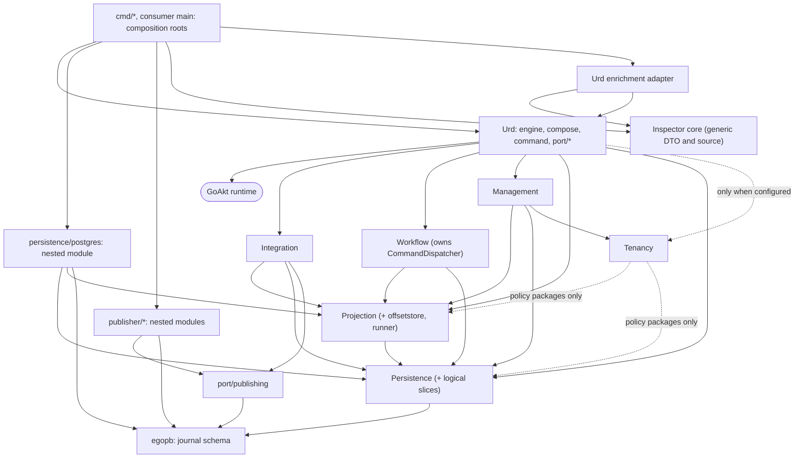

# ADR: Module topology, adapters, journal schema and capabilities (amendment to ego-arch-001)

| Field | Value |
|---|---|
| Status | **Proposed.** Drafted for review; not approved. Approval is a maintainer decision recorded on #347. Nothing here is delivered code. |
| Date | 2026-10-07 |
| Tracker | #347 (I-01), epic #345, phase 0 |
| Amends | ego-arch-001 "Canonical package and module topology" ([archived text](../archive/2026-10-06-pre-persistence-refactor/openspec/changes/ego-arch-001/design.md), historical reference only) |
| Baseline | `develop` at `f5234a6` (#437). Every statement tagged **Current** was read on that SHA with `go1.27.0 darwin/arm64`. |
| Inputs | `docs/prd/urd-platform-prd.md` (sections 2, 3, 4), `docs/prd/i-00-baseline-develop.md` and `docs/prd/i-00-epic-345-audit.md` (historical evidence, not edited here), `docs/prd/urd-module-separation-plan.md` (PR #434, **not merged** at the time of writing), `docs/decisions/actor-reuse-427.md`, `docs/decisions/scoped-offsets-retention.md`, the live body of #347 |
| Scope | Documentation only. No code, schema, `go.mod`, GoAkt or hook change. |

How to read this document. Text tagged **Target** is what this ADR proposes. Text tagged **Current** is the verified state of `develop`. Text tagged **Unverified** is a claim this draft could not check. The target is not implemented; the transition in section 10 says how each gap closes and which issue closes it.

## 1. Context

ego-arch-001 fixed the dependency direction for the root module (contracts at the center, GoAkt and adapters outside) and the rules for when a package becomes a Go module. It was written for the pre-rename repository and its roadmap was archived on 2026-10-06 (#341). Three things changed since:

1. The product now has eight logical boundaries, not four contract families (PRD section 3): persistence, projection, tenancy, Urd, integration, testkit, workflow and management, plus a later generic inspector.
2. **Current:** the archived ADR's rule "an adapter MUST NOT live under a contract package's own path (for example `persistence/postgres`)" contradicts the repository. `persistence/postgres/go.mod` exists and is used by `inttest`, `example` and the CI `modules` job. This is gap B10 in the audit.
3. **Current:** the architecture checker the old ADR relied on (`archcheck`) no longer exists (`docs/engine.md`, section on layers, says it was removed with the old CI pipeline). The only automated boundary checks are per-package `TestArchitecture*` tests listed in `docs/testing/architecture-tests.md`; none states "persistence does not import tenancy" or "persistence does not import projection".

This ADR re-adopts, in one active text, the ego-arch-001 rules that still hold, replaces the ones that do not, and adds the rules for the new boundaries. The archived files stay untouched as history.

## 2. Decisions in brief

| # | Decision | Section |
|---|---|---|
| D1 | The eight boundaries are **package boundaries inside the existing modules**. No new `go.mod` in phases 0 to 2. | 3, 11 |
| D2 | `persistence` imports neither `tenancy` nor `projection` (nor any Urd domain, runtime or GoAkt package). `Scope` becomes an opaque partition key whose persisted form does not change. | 3, 4 |
| D3 | An adapter MAY live under a contract's path **only as a nested Go module**. The PostgreSQL adapter stays at `persistence/postgres` as one module serving every contract it implements, with one pool owner, one migrator and one transaction provider per backend handle. | 5 |
| D4 | `egopb` stays the **journal schema** (`Event`, `Snapshot`, `DurableState`, `Offset`, `ProjectionId`). The engine's own messages move to an internal package with the **same proto package, message names and field numbers**. Moving a Go type is never a data migration. | 6 |
| D5 | Every role (journal, feed, projection destination) has a mandatory capability minimum. An adapter that does not declare it is rejected at composition or startup, before it operates. Atomic effect+marker+checkpoint requires a common transaction in one backend; no cross-database atomicity and no external exactly-once is promised. | 7 |
| D6 | Integration reuses projection, persistence and `port/publishing` (no second runner). Workflow owns a local `CommandDispatcher` port that Urd implements and injects. Management delegates durable operations to their owners. Testkit keeps its utilities and separates unit fakes from real integration. The inspector has a generic core and optional Urd enrichment. GoAkt stays the runtime owner. | 8 |
| D7 | Three tenancy modes: **unscoped** (default, no resolver), **fixed** single tenant, explicit **multitenant**. Persistence and projection never require tenancy. Changing identity requires explicit adoption. | 9 |
| D8 | Each current violation is a named, temporary exception linked to the issue that removes it. Independent module extraction stays optional (#372), after Gate C, without a temporary GoAkt `replace`. | 10, 11 |

## 3. The eight boundaries

The names are logical. Package paths marked **proposed** are not decided here; the first issue that creates the package fixes them (section 14).

### 3.1 Responsibilities, contracts, composition

| Boundary | Responsibilities | Public contracts (existing, **Current**) | Composition |
|---|---|---|---|
| Persistence (#342) | Journal, snapshots, durable state, opaque scopes, logical slices, reader contract, conformance (TCK), schema-migrator contract | `persistence` (`EventsStore`, `StateStore`, `SnapshotStore`, `Scope`, `WritePrecondition`, `SchemaMigrator`, `RetainedEventsDeleter`), journal messages in `egopb`, TCK in `persistence/conformance` | Adapters are constructed by the consumer or by Urd's composition and handed to `compose.Spec`; persistence builds nothing |
| Projection (#343) | Reader execution, destination checkpoints, applied markers, fencing, parking, recovery | `projection` (`Handler`, `Options`, recovery policies, dead letters), `offsetstore` (`OffsetStore`, `ScopedOffsetStore`), runner in `internal/projectionrunner` | Urd injects decoder, metrics and clock into the runner (#364) and starts it as a GoAkt actor (`internal/engine/projection`) |
| Tenancy (#344) | Optional identity and context, resolvers, profiles, cell routing, lifecycle policy | `tenancy` (`TenantID`, `TenantContext`, `TenantResolver`, `FixedTenantResolver`, `WithSingleTenant`, `MarshalMetadata`) | Optional input to `compose.Spec.TenantResolver`; absent in the default mode |
| Urd (#345) | Domain programming model (`command`, `port/behavior`, `port/runtime`), write and read APIs, runtime, composition | `engine`, `compose`, `compose/goakt`, `command`, `port/*`, `eventstream`, `encryption`, `eventadapter` | Owns the composition root and every GoAkt import |
| Integration (#395) | Durable integration envelopes, outbox intents, relay | existing `port/publishing` and `publisher/*` modules; new package **proposed** `integration` | Urd injects codecs and publishers |
| Testkit (#396) | Deterministic fakes, fault drivers, harness | `testkit`, `persistence/conformance`, `port/adapter/adaptertest`, `port/publishing/publishingtest`; real-resource harness in `inttest` | Used by tests only |
| Workflow (#397) | Consolidated sagas and processes: inbox, state, intents, timers, compensation | today: `port/behavior` saga types and `internal/engine/saga`; new package **proposed** `workflow` | Defines `CommandDispatcher`; Urd implements and injects it |
| Management (#398) | Authorized operational facade, audit, observability | new package **proposed** `management` | Urd composes it over public control interfaces |
| Inspector (#419 to #422, later) | Read-only observation of actors | none yet (**Current:** no `cmd/` directory) | `cmd/urd-inspect` is a composition root |

### 3.2 Allowed and forbidden dependencies

"Public contract" means an exported package that satisfies the contract rules of section 4. A boundary MAY NOT import anything not listed under "May import". "Must not" lists the cases the review and the architecture tests (#353) have to catch first.

| Boundary | May import | Must not import |
|---|---|---|
| Persistence | standard library, `egopb` (journal schema), the protobuf runtime, small runtime-neutral libraries named in section 4 | `tenancy`, `projection`, `offsetstore`, `eventstream`, `command`, `encryption`, `eventadapter`, `engine`, `compose`, `internal/extensions`, any workflow/integration/management package, GoAkt, database drivers, `testkit` |
| Projection (including `offsetstore` and the runner) | `persistence`, `egopb`, standard library, protobuf runtime; codecs, metrics and clock come in through interfaces it declares | `tenancy`, `encryption`, `eventadapter`, `eventstream`, `engine`, `compose`, GoAkt, integration/workflow/management, drivers, `testkit` |
| Tenancy | standard library; **policy** packages (profiles, routing, lifecycle) may import public `persistence` and `projection`; the identity leaf (`TenantID`, `TenantContext`, resolver, metadata) imports neither | `engine`, `compose`, GoAkt, any package that persistence or projection would then have to import (no cycle), drivers |
| Urd | every public contract above, GoAkt, OpenTelemetry | adapter modules (drivers), `testkit`/TCK packages outside `_test.go`, `cmd/*` |
| Integration | public `projection`, `persistence`, `egopb`, `port/publishing` | `engine`, `compose`, `internal/*` of Urd, `workflow`, `management`, a second journal runner, brokers or transports directly (publishers are `port/publishing` adapters) |
| Workflow | public `projection`, `persistence`, `egopb`; its own `CommandDispatcher` port | `engine`, `compose`, `command` (Urd's envelope), `integration`, `management`, a second journal runner |
| Management | public control interfaces of `projection`, `tenancy`, `persistence` | `engine`, `compose`, direct SQL or backend types, a reimplementation of replay, rebuild or migration |
| Testkit and TCK | public contracts, `egopb`, standard library | any production package importing it back (section 4, R11) |
| Inspector core | standard library | `engine`, `tenancy`, `command`, any Urd domain package |
| Adapters (nested modules) | their contracts, `egopb`, third-party backend libraries | `engine`, `compose`, GoAkt, `testkit`, `migration` |

### 3.3 Target dependency graph

Arrows read "imports". Dotted arrows are optional or policy-only.

`Urd --> Workflow` shows who imports whom. The port is declared in Workflow and implemented by Urd, so the dependency never points from Workflow to the root.

## 4. Dependency rules

These rules replace section 3 of ego-arch-001. Rules marked "carried" are ego-arch-001 rules that this ADR re-adopts unchanged in intent; they were not re-derived beyond the graph in section 16.

| ID | Rule |
|---|---|
| R1 | **Persistence is a leaf of the product graph.** It MUST NOT import `tenancy`, `projection`, `offsetstore`, any Urd domain or runtime package, or GoAkt. Its dependency closure contains no engine message (section 6). |
| R2 | **Projection depends downward only.** It MAY import public `persistence` contracts and `egopb`. Codec, metrics and clock arrive as interfaces. Its closure MUST NOT contain `tenancy`, `encryption`, `eventadapter` or `eventstream` once #364 lands. |
| R3 | **Tenancy is optional and never required by R1 or R2.** The identity leaf stays free of `persistence` and `projection` so that `command` and `eventstream` can keep importing it. Where the TenantID-to-Scope conversion lives is decided in #349, under the constraints: no import cycle, and persistence closure without `tenancy`. |
| R4 | **Urd owns GoAkt.** Only Urd runtime packages (`engine`, `compose/goakt`, `internal/engine/*`, `internal/extensions`, `internal/goaktlog`) import `github.com/tochemey/goakt/v4`. No contract, adapter, integration, workflow, management or inspector-core package does. |
| R5 | **Contracts are runtime-free (carried).** A contract package MUST NOT import GoAkt, OpenTelemetry, broker clients, database drivers, `net/http`, `net/rpc` or `database/sql`, nor the root runtime, `internal/extensions`, `migration`, or test support outside `_test.go`. Third-party libraries in a contract are a closed list; today `github.com/google/uuid` and `go.uber.org/atomic` (ego-arch-001), unverified on this SHA. |
| R6 | **No inverse imports.** No lower boundary imports a higher one: persistence, projection, tenancy, integration, workflow and management never import `engine`, `compose` or each other upward (Integration, Workflow and Management never import Urd; Management never imports Workflow or Integration). |
| R7 | **Integration, Workflow and Management do not copy machinery.** They MUST NOT carry their own runner, ownership/fencing, transaction or tenant state machine; they use projection's. |
| R8 | **Workflow's dispatch port is local.** `CommandDispatcher` is declared in `workflow`; Urd implements it and injects the adapter. |
| R9 | **Adapters are leaves.** An adapter imports its contracts, `egopb` and third-party libraries; it MUST NOT import `engine`, `compose`, GoAkt, `testkit` or `migration`. Backend-specific types stay inside the adapter module (section 5). |
| R10 | **No module names a concrete engine outside its adapter.** "Names" means importing a driver or SDK, exposing a backend type in an exported signature or configuration struct, or branching on a backend identifier. The root module's `go.mod` requires no database driver. Documentation, comments and test fixtures may mention a backend. |
| R11 | **Production does not import testkit or `cmd`.** No non-test package of a library module imports `testkit`, `persistence/conformance`, `port/adapter/adaptertest`, `port/publishing/publishingtest`, `internal/engine/enginetest` or `cmd/*`. `cmd/*` is a composition root: nothing imports it, and it does not import `testkit`. The `example` module is a consumer and is exempt (section 10, T9). |
| R12 | **No new `go.mod` in phases 0 to 2** (section 11). |
| R13 | **Across modules (carried):** no cycle between the root and a nested module; no import of another module's `internal/` packages. |
| R14 | **Temporary exceptions are listed, owned and enforced** (section 10). An unlisted violating import fails the architecture lane (#353). |

## 5. Adapter location (resolves B10)

### 5.1 The rule today

**Current:** ego-arch-001 said an adapter must not live under its contract's path because everything under a contract path is a contract and must pass the contract allowlist. The repository has `persistence/postgres` as a nested module that imports pgx. Both cannot hold, and a check that compares them does not exist.

### 5.2 Amended rule

**Target (replaces the ego-arch-001 bullet).**

- **A1.** A *package of a module* under a contract's path is a contract and must satisfy R5. A directory that carries its **own `go.mod`** is a different module; its packages are not packages of the contract's module and are judged as an adapter (R9), not as a contract.
- **A2.** The only adapter module at a contract path that this ADR blesses is `persistence/postgres` (module path unchanged). A new adapter module needs its own `go.mod` decision, which phases 0 to 2 forbid (R12); until then, new adapters go in the module that already exists or stay in-process (`testkit` memory adapters).
- **A3.** The module path names the **primary** contract and the backend, not the full list of contracts the module serves. `persistence/postgres` will also serve projection contracts (offsets today, destination and fencing later). Renaming it would break `inttest`, `example` and consumers for no boundary gain.
- **A4.** The architecture test that enforces A1 (#353) treats a directory with a `go.mod` as outside the contract package set, and fails for a non-module package under a contract path that imports a driver or fails R5.

This keeps the nested module (the plan's "preserve existing nested modules, PostgreSQL included" and #372's "keep the nested PostgreSQL adapter"), keeps the root module free of pgx (**Current:** `go.mod` of root has no pgx; pgx appears only in `persistence/postgres`, `inttest` and `example`), and does not force a repository-wide import-path change.

If persistence is later extracted as its own module (#372), `persistence/postgres` stays nested inside its directory. Go excludes a nested module from the enclosing one. **Unverified:** that layout was not built in this draft; it follows from Go's module rules and must be confirmed in #372.

### 5.3 One PostgreSQL adapter, several contracts

**Current (verified).** `persistence/postgres` is one module and one package `postgres`. `EventStore` (`event_store.go:61`) and `OffsetStore` (`offset_store.go:40`) each own a `*pgxpool.Pool`, each build it in their own `Connect` with `MaxConns = 20`, and each run `NewSchemaMigrator(s.pool).Migrate`. Neither implements `Describe()`, so neither declares a `Descriptor`. There is no shared transaction. `SnapshotStore` and `StateStore` have no PostgreSQL implementation (#435).

**Target invariants** (names and constructors are open, see section 14, P8):

| ID | Invariant |
|---|---|
| I1 | One pool owner per backend handle. Event, offset, state, snapshot, reader, destination and fence implementations **borrow** it. Whoever created a pool closes it; a borrowed pool is never closed by a consumer of it (PRD C-section "borrowed versus owned"). |
| I2 | One schema migrator and one version table (`ego_schema_migrations`) for the whole module. Migration files stay numbered in `persistence/postgres/schema` (**Current:** version 6, `006_scoped_offsets.sql`). A shared database is migrated once, by whichever starts first, as today. |
| I3 | One transaction provider on the shared handle. The destination effect, the applied marker and the checkpoint commit through it. This is what makes "common transaction" a declarable capability (section 7). |
| I4 | Backend types (`pgx.Tx`, `pgxpool.Pool`, driver errors, SQL) never appear in the signature of a contract package. They MAY appear in the adapter module's public API, because a handler that writes in the destination transaction has chosen PostgreSQL by importing it. The contract exposes an opaque or type-parameterized transaction handle (shape decided in #362 and #373). |
| I5 | Each implementation declares a truthful `adapter.Descriptor` (ports and capabilities). One Go type may serve several ports (the `Descriptor` already allows it) or several types may share one handle. |
| I6 | Journal/feed and destination resources are configured separately (PRD C-02) even though one module provides both. "Common transaction" is declared only when the destination effect and its offset store share the same handle. |

Memory adapters (`testkit`) are the second initial adapter family (PRD section 4). They implement the same contracts without a driver, so they stay in the root module and are test support (R11).

## 6. Location of `egopb`

### 6.1 What is in it today

**Current (verified).** `protos/ego/ego.proto` (`package egopb`) generates a single Go package `egopb` (`egopb/ego.pb.go`, source `ego/ego.proto`). It mixes:

| Group | Messages | Direct production users on `f5234a6` |
|---|---|---|
| Journal | `Event`, `Snapshot`, `DurableState`, `Offset`, `ProjectionId` | `persistence`, `offsetstore`, `port/publishing`, `migration`, `testkit`, `persistence/postgres`, the four `publisher/*` modules, `internal/projectionrunner`, `engine`, `internal/engine/*` |
| Engine | `CommandReply`, `StateReply`, `SagaLifecycleStatus`, `ErrorReply`, `NoReply`, `GetStateCommand`, `TenantBindingQuery`, `TenantBindingReply`, `ActorBindingQuery`, `ActorBindingReply` | `engine`, `internal/engine/{protocol,eventsource,durablestate,saga,enginetest}` only. `persistence/conflict.go` mentions `egopb.CommandReply` in a comment, not in code |

Because `persistence`, `offsetstore` and `port/publishing` import `egopb`, their dependency closure includes the engine messages. #363 asks that it not. A grep of exported function signatures in `engine`, `command`, `compose` and `port/*` found no engine message in any (one-line signatures only; **Unverified** for multi-line signatures, struct fields and external consumers).

### 6.2 Decision

**Target.**

- **`egopb` is the journal schema and nothing else.** Its Go import path, its proto package name `egopb`, and its messages `Event`, `Snapshot`, `DurableState`, `Offset`, `ProjectionId` do not change. Publishers, `port/publishing`, the PostgreSQL adapter, `testkit` and user code keep compiling and keep their wire format.
- **Engine messages move to `internal/engine/enginepb`** (**proposed** path; any package under `internal/engine/` that is not importable from persistence or projection satisfies the rule). They are the engine's private protocol, as `TenantBindingQuery` is already documented to be ("engine-internal control message").
- **No type alias for an engine message is left in `egopb`.** An alias would make `egopb` import `enginepb` and put the engine messages back in the persistence closure. If an external consumer of an engine message is found (**Unverified**), the alias goes in `engine`, not `egopb` (open, P6).

### 6.3 What must not change (so the move is not a data migration)

| Aspect | Rule | Why |
|---|---|---|
| Proto package | New file keeps `package egopb;` | GoAkt remoting carries messages as `Any` with a type URL derived from the full name (`egopb.CommandReply`). Renaming the proto package breaks rolling upgrades. **Unverified** until the two-version test below runs |
| Message and enum names, enum values | unchanged | same |
| Field numbers, `reserved`, oneof layout | unchanged; no field added or removed in the move | binary compatibility; `Event` keeps `reserved 5` |
| Journal file | `protos/ego/ego.proto` keeps its path and its journal messages byte-for-byte | descriptor and registry identity |
| Persisted keys and rows | none touched. **Current:** the PostgreSQL event row stores `proto.Marshal` of the inner `Any` (`event_store.go:172`) with the user event's type URL as manifest, keyed by `(tenant_id, persistence_id, sequence_number)`. No `egopb` name is part of that key or payload | the move cannot rewrite what it does not store |
| Schema | no migration file | a package reorganization is not a schema change |
| Snapshot and durable-state serialization in other adapters | **Unverified** (no PostgreSQL implementation exists; memory stores are not durable) | #435 records its own format decision |

### 6.4 Compatible transition (executed by #363, not by this ADR)

1. Add `protos/engine/engine.proto` with `package egopb;`, the engine messages copied unchanged, and `go_package` `github.com/getsyntegrity/urd/internal/engine/enginepb;enginepb`. Remove those messages from `ego.proto` **in the same commit** and regenerate. Both files cannot declare the same full name, so the cut must be atomic.
2. `buf.yaml` enables `PACKAGE_SAME_GO_PACKAGE`; one proto package with two `go_package` values violates it. #363 records a scoped lint exception, and runs `buf breaking` with a wire-level category for this change (the `FILE` rule flags a message moved between files even when the wire is identical). Both choices are P6.
3. Change imports in `engine` and `internal/engine/*` only.
4. Tests that must pass before merge: descriptor test over both files (the pattern in `egopb/descriptor_test.go`); golden marshaled bytes for every moved message; registry lookup of each full name `egopb.<Name>`; `go list -deps ./persistence ./offsetstore ./port/publishing` contains no engine message package; a mixed-version check between a node built before the move and one after (the #427 decision already states older nodes fail closed on newer queries; the test shows the rest of the protocol is unaffected).
5. Journal types are not moved in phases 0 to 2. If they ever change Go path, the old path keeps type aliases (identity-preserving) and the proto package, names and numbers do not change. Changing any of those is a data migration with its own decision, never a reorganization.
6. If #362 introduces a new checkpoint identity (mode, scope or cell, processor, projection version, slice), it adds new messages or fields additively. It does not edit `Offset` or `ProjectionId` in place.

## 7. Minimum capabilities per role

### 7.1 Mechanism that exists

**Current (verified).** `port/adapter` defines `Descriptor{Ports, Name, Capabilities}` and the single accessors `Describe`, `StarterOf`, `PingerOf`. Contract packages name ports and capabilities as untyped string constants (`persistence.PortEventsStore`, `tenancy.CapFixedTenant`). `compose.Spec.Validate` rule V8 checks a **declared** descriptor in both directions for the capabilities it knows. V8c, "an adapter declares every capability its slot requires", exists, but `requiredCapabilities` is an empty map (`compose/spec.go`) and a value that declares no descriptor is not inspected. Only `testkit` stores and `publisher/websocket` implement `Describe()`; the PostgreSQL adapter does not. Optional behaviors already enforced where the feature is selected: `offsetstore.ScopedOffsetStore` (a tenant projection fails closed on an adapter without it) and `persistence.RetainedEventsDeleter` (automatic retention is rejected with `ErrUnsafeEventRetention` without it). Whether each of those is rejected before the first operation on every code path is **Unverified**.

### 7.2 Roles and minimums

Capability names below are illustrative and follow the existing constant style; the final names and rule IDs are P4. #384 implements; #351 defines the feed semantics.

| Role | Mandatory (declared, proven by TCK) | Optional (absence is valid; features that need it are rejected) | State on `develop` |
|---|---|---|---|
| **Journal** (`persistence`) | conditional append with expected revision; uniqueness; **contiguous batch starting at revision+1**; per-entity stream read; declared command dedupe | snapshots; durable state; `RetainedEventsDeleter`; schema migrator; start; ping | Append checks revision only: the audit records that a gap is accepted (#354). Stream read and uniqueness exist (primary key). No command dedupe (#357) |
| **Feed** (reader for projections, integration, workflow) | declared **stable prefix** (after cursor `c`, nothing at or before `c` becomes visible); declared **eligibility** rule; durable, validated, versioned opaque cursor | per-slice range reads; wakeup notification (latency only, never the recovery source) | Not met. The runner reads with `GetShardEvents` and a timestamp cursor; `persistence/events_store.go` acknowledges the late-commit gap. Mechanism is Gate A (#387, #352); this ADR does not choose it |
| **Projection destination** | **common transaction** for effect, applied marker and checkpoint **or** a declared idempotent-upsert strategy; ownership **fencing** validated at the destination; checkpoint identity (mode, scope or cell, processor, version, slice) stored in the destination backend | `ScopedOffsetStore`; parking storage | No common transaction; `OffsetStore` is its own store; no fencing (#373, #374, #362) |

### 7.3 Where a missing guarantee is rejected

An adapter that lacks a mandatory capability for a role in use is rejected **before it operates**, at one of three points:

1. **Static composition** (`compose.Spec.Validate`, no I/O): populate `requiredCapabilities` per port and add a role-level rule. A role is "in use" when the spec needs it: events store for event-sourced, saga or projections; offset store and destination for projections.
2. **Startup** (GoAkt extension `PreStart` after #383, or `Engine.Start`): probes that need I/O (reachability, schema version, privileges, transaction settings documented by #352). A failed probe stops start; no command is accepted.
3. **Conformance**: the TCK selects its cases from the declared capabilities and never skips a mandatory one. A capability declared without passing its cases is a defect, not a degraded mode.

Declaration rules: a declared capability must be implemented (V8b, exists); an implemented known capability must be declared (exists); a **semantic** capability that cannot be shown by a type assertion (stable prefix, contiguity) is proven only by the TCK, so declaring it is a claim the adapter owns.

Legacy adapters: **Target** is that an undeclared adapter is treated as declaring nothing, so it fails a mandatory minimum. Whether existing deployments are grandfathered for a window, and until when, is P7. Meanwhile `requiredCapabilities` stays empty on `develop`, so nothing is rejected yet.

### 7.4 What is and is not promised

- Effect, applied marker and checkpoint are atomic **only** when they commit in one transaction of one backend (invariant I3). When the destination cannot offer one, it must declare an idempotent-upsert strategy plus fencing, and the guarantee is at-least-once with an idempotent effect.
- **No cross-database atomicity.** A journal in one backend and a destination in another gives no atomic append-plus-effect. SharedCell with independent destinations under one shared checkpoint is rejected in V1 (PRD C-05).
- **No external exactly-once.** A publication to a broker is at-least-once with a stable identity: the intent is recorded in the destination transaction (outbox), the relay claims it with a fence, and a crash after the broker acknowledges may duplicate delivery. Consumers deduplicate on the stable ID. Compensation does not roll back external effects.
- Notifications only improve latency. Polling and durable state are the recovery source.

## 8. Additional boundaries

### 8.1 Integration (#395)

Consumes a confirmed journal event through the existing reader and runner, and records the outbox intent, applied marker and checkpoint in one destination transaction. The relay uses fencing and bounded retries and records delivery only after a **declared** publisher ACK. Publishers are the existing `port/publishing` adapters; **Current:** the four publisher modules import only `egopb` and `port/publishing` (websocket also `port/adapter`). Urd supplies codecs and composition. Integration never imports `engine` or `compose`, never starts a second journal runner, and adds no broker, transport or `go.mod`. **Current:** `port/adapter` has `CapStart` and `CapReady` only; ACK and failure capabilities are #399, #402.

### 8.2 Workflow (#397)

`workflow` declares the `CommandDispatcher` port (at-least-once delivery with stable command IDs, compensation with its own stable identity). Urd implements it and injects the adapter. Workflow defines its own command value so it does not import `command`; Urd maps between them. Its state, inbox dedupe, command intent and checkpoint use the projection destination transaction. Workflow is a **Urd-specific consolidation** of the existing saga machinery, informed by actor and event-driven systems; it is not a claimed equivalent of an Akka or Lagom module. **Current:** sagas live in `port/behavior` and `internal/engine/saga`; no dispatcher port exists.

### 8.3 Management (#398)

Consumes public control interfaces of projection, tenancy and persistence; Urd composes. Durable pause and resume primitives live in **projection**, so projection never imports management. Replay, rebuild, version change, migration and deletion delegate to their existing owners and are enabled only when the owner declares the capability. Management adds authorization, deduplication, audit and fencing around them; it implements none of them.

### 8.4 Testkit (#396)

`testkit` keeps its current utilities (memory events, state, snapshot and offset stores with `Describe()`, key store, scenario helpers) and is extended, not copied. Two layers stay separate:

| Layer | Home | May use |
|---|---|---|
| Unit fakes, clocks, fault drivers | `testkit` (root module) | no real resource; enforced for tests by `.github/scripts/unitgate` (**Current:** it flags real-resource calls such as `database/sql.Open`) |
| TCK suites | `persistence/conformance`, `port/*/…test` | run against fakes or real adapters |
| Real integration | `inttest` nested module with `inttest/infra/<backend>` (Testcontainers) | Docker, PostgreSQL; CI `inttest` lane |

Production packages do not import any of them (R11). **Current:** the only non-test importers of `testkit` are the three `example/*/main.go`; no non-test package imports `persistence/conformance`; `internal/engine/enginetest` is imported only from `_test.go` files.

### 8.5 Inspector (#419 to #422, later)

- A **generic core** (**proposed** package `inspect`) defines the observation DTO and a `Source` interface using only the standard library. It imports no Urd domain, no `tenancy`, no `command`.
- A **GoAkt collector** may import GoAkt but not Urd.
- An **Urd enrichment adapter** (**proposed** `inspect/urd`) may import `engine` and `tenancy`; it is optional and only reports metadata the operator authorized.
- `cmd/urd-inspect` is the terminal **composition root** that wires them. It has no new `go.mod`. **Current:** `cmd/` does not exist.
- The inspector never requires Urd tenancy to inspect a GoAkt deployment. Whether the pinned GoAkt fork exposes the needed hooks is #419's audit; this ADR assumes nothing about it.

### 8.6 GoAkt

GoAkt remains the runtime owner of actors, remoting, supervision, placement and extensions (R4). Urd does not duplicate those and this work changes nothing in GoAkt. **Current:** the root `go.mod` pins a GoAkt pseudo-version and carries a `replace` to `github.com/pablogore/goakt/v4 v4.5.7-actorof.1` (`go.mod:93`, marked TEMPORARY). Every nested module that has a `go.mod` declares the same `replace` (section 11).

## 9. Tenancy modes

### 9.1 Modes

API names are proposed; #424 makes the final choice. **Current:** `tenancy.WithSingleTenant(id)` builds a resolver that also implements `FixedTenantResolver`; with no resolver registered the engine runs in legacy mode and uses `persistence.Unscoped()`.

| Mode | Selected by | Scope | Persisted key (**Current**, PostgreSQL) | Tenancy services required |
|---|---|---|---|---|
| **Unscoped** (default) | no tenancy configuration | `Unscoped()` | `tenant_id = ''` | none: no resolver, catalog or tenancy extension |
| **Fixed** single tenant | `WithSingleTenant(id)` (or an equivalent fixed binding) at startup | tenant scope of `id` | `tenant_id = id` | a fixed resolver; no catalog, no per-operation resolution |
| **Multitenant** | an explicit `TenantResolver` | tenant scope per operation | `tenant_id = id` | the configured resolver and policies; missing or invalid identity is rejected |

Tenancy mode is independent of node count, cell placement, Shared or Dedicated pool access and PerScope or SharedCell processing. Authentication, authorization, admission limits and backpressure still apply in every mode.

### 9.2 Required services per capability

| Capability | Unscoped | Fixed | Multitenant |
|---|---|---|---|
| Journal append and read (`persistence`) | none | none | none |
| Projection runner, PerScope | none; offsets under `Unscoped` | `ScopedOffsetStore` | `ScopedOffsetStore` |
| Projection, SharedCell | explicit privileged selection, never implied by `Unscoped` | same | same |
| Command entry and context propagation | none | fixed resolver | resolver |
| Resource profile and cell routing (#368) | default cell, trivial router | default cell, optional profile | tenancy policy services when configured |
| Integration and workflow identities | include the explicit unscoped scope | include the fixed scope | include the resolved scope |
| Management | operates in the configured scope | same | needs tenancy control interface |
| Inspector | none | none | none |

Persistence and projection never require tenancy: the persistence-side requirement is the opaque scope value, which composition supplies.

### 9.3 Configuration errors (rejected at configuration or startup)

- Multitenant requested without a `TenantResolver`.
- A fixed identity that fails tenant-ID validation, or two explicit identities that conflict (a fixed resolver plus a different spawn-time tenant).
- A tenant-scoped projection on an adapter without `ScopedOffsetStore` (**Current:** fails closed).
- A missing role capability (section 7), including a mode that needs a scoped capability the adapter does not declare.
- A mode that implies a service the composition did not supply. Unscoped needs none, so it can never fail for that reason.

Not rejected automatically: starting in fixed or multitenant mode over a database that holds unscoped rows. That cannot always be detected without I/O and is a data-adoption matter (below). Whether a startup probe warns is P5.

### 9.4 Data preservation and identity change

- Staying unscoped preserves stored keys, streams, snapshots and offsets with no migration. `Unscoped()` never equals or collides with a tenant whose id is the text `unscoped`, and never means "all tenants".
- **Changing identity is explicit adoption.** Unscoped to fixed or multitenant does not reinterpret old rows: unscoped data stays under `''` and is invisible to a tenant scope until adopted. **Current:** the explicit path is `migration`'s tenant adoption (`TenantAdopter`), verified on PostgreSQL by `inttest/flows/tenancy`.
- Fixed `X` and multitenant resolving to `X` address the same keys, because the persisted key is the tenant identifier. Fixed `X` to fixed `Y` addresses different data.
- Cursors and offsets are not reused across identities. **Current** (`scoped-offsets-retention.md`): existing offset rows stay under `Unscoped`; tenant projections start with fresh cursors and may replay, so handlers tolerate replay.
- The actor namespace (`WithActorNamespace`) separates **actor addresses only**; it does not change a persisted key or create a separate journal (`actor-reuse-427.md`).
- No fabricated tenant ID (such as a default tenant) is ever introduced to make a mode work.

## 10. Transition

All rows are **Current**, verified on `f5234a6` unless marked. Until its issue lands, each exception is listed by the architecture test (#353) with that issue's link; an exception without a link is a defect in #353's list.

| ID | Current fact | Violates | Temporary exception | Removed by |
|---|---|---|---|---|
| T1 | `persistence/scope.go:28` and `persistence/conflict.go:30` import `tenancy`; `Scope` stores a `tenancy.TenantID` and exposes `TenantID()` | R1 | `persistence -> tenancy` | #349 (Scope opaque, key unchanged: `''` for Unscoped, tenant ID otherwise; conformance still passes) |
| T2 | `egopb` carries engine messages, so the closure of `persistence`, `offsetstore` and `port/publishing` includes them | R1, section 6 | `persistence -> egopb` closure includes engine messages | #363 |
| T3 | `internal/projectionrunner` imports `encryption`, `eventadapter`, `eventstream`, `internal/instrumentation` besides `egopb`, `offsetstore`, `persistence`, `projection`; through `eventstream` its closure contains `tenancy` | R2 | the four extra imports | #364 (needs #353) |
| T4 | Projection concerns are spread over `offsetstore`, `projection` and `internal/projectionrunner` | R2, boundary shape | none (not a forbidden edge; a layout debt) | #365 (needs #362, #363, #364), with compatibility aliases |
| T5 | `persistence/postgres` exists at a contract path as a nested module | archived ego-arch-001 adapter rule | none after this ADR: A1 supersedes the old rule | this ADR; enforced by #353 |
| T6 | PostgreSQL adapter: two pools (`MaxConns` 20 each), per-store migrate, no `Describe()`, no shared transaction | I1, I3, I5 | duplicate pools | **No issue is assigned to pool unification.** Proposed: #373 (common transaction needs the shared handle); P8 asks the maintainers to confirm or open one. Descriptors: #384. Snapshot and state adapters: #435 |
| T7 | `compose.requiredCapabilities` is empty; undeclared adapters are not inspected | section 7 | no mandatory minimum enforced | #384 (needs #351) |
| T8 | No test states R1, R2, R4, R6 to R11. Only per-package `TestArchitecture*` closure tests exist (`docs/testing/architecture-tests.md`) | R14 | boundaries rest on review | #353 |
| T9 | `example/{eventssourced,saga,durablestate}/main.go` import `testkit` | R11 | the `example` module is a consumer, exempt by rule, permanent | none; #353 scopes R11 to library modules |
| T10 | Root `go.mod` and every nested `go.mod` carry the temporary GoAkt `replace` | #372 conditions | blocks independent publication | #326 (referenced by #372); not part of this ADR |
| T11 | `cmd/` does not exist; no `integration`, `workflow`, `management`, `inspect` package exists | none yet | none | #395, #397, #398, #419 create them under R6 to R8 |

Ordering follows the plan: this ADR, then phase-0 contracts and Gate A (#387), then phase 1 (#349, #353, #363, #364, #365, #362, #384), Gate B (#388), phase 2, Gate C (#389), then optional #372. Package moves come after the dependency inversions, never before.

## 11. Go modules

**Current:** ten `go.mod` files: root, `persistence/postgres`, `inttest`, `benchmark`, `example`, `test/compat`, `publisher/kafka`, `publisher/nats`, `publisher/pulsar`, `publisher/websocket`. All declare `go 1.27.0` (#426).

- **Phases 0 to 2: no new `go.mod`.** The eight boundaries, the inspector and every new package are packages in the root module. The existing ten stay, `persistence/postgres` included.
- Naming a boundary "module" does not extract it. Independent extraction (`persistence`, `projection`, `tenancy` with their own `go.mod`) stays **optional** under #372, after Gate C (#389), and only when all hold: no temporary GoAkt `replace`; each module builds and passes its TCK against a **published** root version (a local `replace` or workspace is not enough); the versioning policy applies; tenancy has a second consumer; `persistence/postgres` stays nested.
- ego-arch-001's section 6 criteria (rules hold for a release, a package cannot give the benefit, CI verifies it, it can be released, no hidden coupling) are kept as the entry test for #372.

## 12. Alternatives considered

| Topic | Alternative | Why not chosen |
|---|---|---|
| Adapter location | Move PostgreSQL to a new top-level path (for example `adapter/postgres`) | Breaks the import path used by `inttest`, `example` and consumers; contradicts "keep the nested adapter" (#372); gains nothing a rule on `go.mod` boundaries does not |
| | One module per contract (`persistence/postgres`, `projection/postgres`) | Duplicates pools, migrators and transactions, and cannot offer a common destination transaction |
| | Adapter packages inside the root module | Puts pgx in the root module's requirements |
| `egopb` | Keep one package | Fails #363: persistence closure keeps engine messages |
| | Move journal types to `persistence/journalpb`, leave engine messages in `egopb` | Breaks publishers, `port/publishing`, testkit and user imports for the sake of the larger group |
| | Rename the proto package or messages | Changes the remoting type URL; a rolling upgrade breaks |
| | Separate Go module for the schema | New `go.mod`, forbidden in phases 0 to 2 |
| | Aliases for engine messages in `egopb` | Reintroduces them into the persistence closure |
| Capabilities | Probe at runtime only | Late and non-deterministic; violates "rejected before operating" |
| | Declarations only, no TCK | A semantic claim (stable prefix) is not provable by types |
| | Grandfather every undeclared adapter forever | Mandatory minimums would be unenforceable |
| Tenancy | Default tenant ID for single-tenant mode | Fabricates an identity and changes persisted keys |
| | One mode (always multitenant) | Single tenancy is a first-class mode, not a degraded one (PRD) |
| Boundaries | Eight Go modules now | Phase 3 is optional and needs Gate C evidence; the plan keeps boundaries as packages first |
| Workflow | Workflow calls Urd's command API directly | Inverse dependency on the root (R6) |
| | Integration with its own journal runner | Second runner, second fencing and transaction machine (R7) |

## 13. Rationale and consequences

**Rationale.** The graph on `develop` already has the right direction for most edges: `persistence` imports only `egopb` and `tenancy`; `projection` imports only `persistence`; no contract imports GoAkt (`go list -deps` of `persistence`, `projection`, `offsetstore`, `tenancy`, `egopb`, `port/publishing` contains no GoAkt package). The few inversions are small, named and removable. The amendment therefore fixes rules and exceptions rather than moving directories, so refactors in phase 1 are mechanical and each one is checkable by an import test.

**Consequences.**

- Good: persistence and projection become usable without tenancy or Urd; the nested PostgreSQL adapter survives; capability gaps surface at startup instead of as lost events; a package move is never a data change.
- Cost: `Scope` loses its `tenancy` types (T1) and every adapter must read an opaque key instead of `TenantID()`; two protobuf files share one proto package and need a lint exception (P6); the PostgreSQL module needs a shared-handle redesign (T6); legacy adapters either get a grandfather window or fail startup (P7).
- Risk: boundaries are enforced by review until #353 lands; GoAkt's fork `replace` still blocks extraction.
- Nothing in this ADR claims a guarantee is delivered. The PRD says the same: this is a proposal for implementation planning.

## 14. Pending decisions

None of these is silently chosen. The draft states the working assumption and does not block on them.

| ID | Decision | Owner and issue | Resolves when | Working assumption in this draft |
|---|---|---|---|---|
| P1 | Logical slice count N (256 or 1024), hash, key encoding. **Not ratified.** PR #436 holds a provisional, unexported `sliceOfProvisional` with `provisionalSliceCount = 1024` | Maintainers, #350; coordinated with #351 and #350's decision doc | A maintainer decision recorded in #350, before `SliceOf` is exported | Slices belong to persistence (R1). Nothing here fixes N |
| P2 | Offset migration, cutover, and events removed by retention | #359 (with #351, #362) | #359 records the strategy and its verification | None; section 6 and section 9 only promise that a package move changes no stored data |
| P3 | `Scope` API shape, where TenantID-to-Scope conversion lives, key validation | #349 | #349 design, under R1 and R3 | Persisted key unchanged |
| P4 | Capability constant names, rule IDs, `requiredCapabilities` content | #384, #351 (feed semantics) | #384 merged with TCK cases per capability | Table 7.2 is illustrative |
| P5 | Final tenancy mode API names; whether to probe for unscoped rows when starting fixed or multitenant | #424 | #424 design | Names in 9.1 are proposals |
| P6 | Engine message path; lint exception for `PACKAGE_SAME_GO_PACKAGE`; `buf breaking` category; alias in `engine` if an external consumer exists | #363, maintainers | #363 design plus its wire tests | `internal/engine/enginepb`, no aliases |
| P7 | Legacy undeclared adapters: reject or grandfather, and until when | #384, maintainers | #384 design | Reject once mandatory minimums are enforced |
| P8 | PostgreSQL shared-handle API; which issue owns pool unification | #373, #362, #435; owner `persistence/postgres` maintainers | Confirmed or new issue; #373 design | Invariants I1 to I6 only |
| P9 | Package paths for `integration`, `workflow`, `management`, `inspect`, `inspect/urd` | #395, #397, #398, #419 | The first PR of each issue | Paths in 3.1 are proposed |
| P10 | The #364 text says the runner imports only `persistence`, `offsetstore` and `egopb`, but the runner also imports `projection` for `Handler` and `Options` (**Current**). After #365 `projection` is its own boundary | #364, #365 | Clarified in #364's design | The runner is part of the projection boundary, so importing sibling `projection` is internal |
| P11 | Classification of `encryption`, `eventadapter`, `eventstream`, `migration` | #353 | #353's package list | Urd-owned: they are never imported by persistence or projection (target) |

## 15. Traceability: #347 criteria to sections

Criteria are the live body of #347 (original acceptance, the amendment on additional boundaries, and the single-tenant clarification).

| # | Criterion (#347) | Section | Status of the answer |
|---|---|---|---|
| 1 | ADR declares persistence imports neither tenancy nor projection | 3.2, R1, T1 | Rule stated; code still violates it (T1, #349) |
| 2 | Resolves the adapters-under-contract-path rule (B10) | 5.1, 5.2, T5 | Resolved by A1 to A4 |
| 3 | Defines where `egopb` lives | 6, T2 | Journal stays; engine messages to `internal/engine/enginepb`; P6 open |
| 4 | No module names a concrete engine outside its adapter | R10, 5.2, 3.2 | Stated; root `go.mod` has no pgx today; no test enforces it (#353, #384) |
| 5 | Minimum capabilities per role; composition rejects an adapter that does not declare | 7 | Mechanism and minimums stated; `requiredCapabilities` still empty (T7) |
| 6 | Integration #395 consumes public projection/persistence and existing `port/publishing`, no root import, no parallel runner | 8.1, R6, R7 | Stated |
| 7 | Workflow #397 consumes public projection/persistence and defines a local `CommandDispatcher` implemented and injected by Urd | 8.2, R8 | Stated |
| 8 | Management #398 consumes public control interfaces; durable projection primitives do not import management | 8.3, 3.2 | Stated |
| 9 | Testkit #396 uses public contracts; no production package imports testkit or `cmd` | 8.4, R11, T9 | Stated; verified on `f5234a6` |
| 10 | Generic inspector #419 to #422: DTO and source in a defined tool boundary, no Urd domain or tenancy; Urd adapter enriches; `cmd` is the composition root | 8.5 | Stated; paths P9 |
| 11 | No new `go.mod`, no new broker, transport or backend; extraction follows #372 and its gates | 11, R12, T10 | Stated |
| 12 | Workflow is Urd's own consolidation with no exact Akka or Lagom equivalent; diagram of allowed dependencies | 8.2, 3.3 | Stated; diagram in 3.3 |
| 13 | Single-tenant clarification: record unscoped (default), fixed and multitenant; persistence and projection do not require tenancy; services required per capability; adoption when identity changes | 9, R3 | Stated; names P5 |
| 14 | Original dependencies and links #349, #353, #363, #364, #365 | 10 | Each linked to the exception it removes |
| 15 | Pending decisions with owner and resolution condition (N, hash and encoding, offset migration, cutover, retention) | 14 (P1, P2) | Registered; not decided here |

## 16. Evidence and unverified claims

### 16.1 Reproduction (all **Current**, on `f5234a6`, `go1.27.0 darwin/arm64`)

| Claim | Command or source | Observed |
|---|---|---|
| Root package graph | `go list -f '{{.ImportPath}} {{range .Imports}}{{.}} {{end}}' ./...` | 43 packages. `persistence -> egopb, tenancy`; `projection -> persistence`; `offsetstore -> egopb, persistence`; `tenancy -> none`; `egopb -> none` |
| Closures | `go list -deps ./persistence`, `./offsetstore`, `./projection` filtered to this module | `egopb tenancy persistence`; plus `offsetstore`; plus `projection` |
| Runner closure includes tenancy | `go list -deps ./internal/projectionrunner` | includes `encryption eventadapter internal/queue internal/syncmap tenancy eventstream internal/instrumentation` |
| GoAkt importers | same listing, packages importing `tochemey/goakt` | `compose/goakt`, `engine`, `internal/engine/{durablestate,enginetest,eventsource,projection,saga}`, `internal/extensions`, `internal/goaktlog` |
| No GoAkt in contracts | `go list -deps ./persistence ./projection ./offsetstore ./tenancy ./egopb ./port/publishing \| grep -c goakt` | `0` |
| Nested module imports | `go list` in each of the ten module directories | `persistence/postgres -> egopb, offsetstore, persistence`; `publisher/{kafka,nats,pulsar} -> egopb, port/publishing`; `publisher/websocket` also `port/adapter`; `inttest/infra/tenantfx -> engine, persistence/postgres, tenancy`; `example/*` import `engine`, `compose`, `testkit`, `projection`, `persistence/postgres` |
| PostgreSQL closure | `go list -deps ./...` in `persistence/postgres` | no GoAkt; first-party `egopb tenancy persistence offsetstore`; pgx present |
| pgx only in adapters | `grep -l jackc/pgx` over `go.mod` files | `inttest`, `example`, `persistence/postgres` |
| Engine messages' users | grep of `egopb.<Message>` in non-test Go files | only `engine` and `internal/engine/*` |
| Duplicate pools | `persistence/postgres/event_store.go:61-88`, `offset_store.go:40-67` | one `pgxpool.Pool` each, `MaxConns = 20` each |
| No descriptor on PostgreSQL | `grep Describe()` | only `testkit` stores and `publisher/websocket` |
| `requiredCapabilities` empty | `compose/spec.go` | empty map |
| Production importers of testkit | grep of non-test files importing `urd/testkit` | `example/{eventssourced,saga,durablestate}/main.go` |
| Journal row format | `persistence/postgres/event_store.go:172`, `schema/001_events_store.sql` | `proto.Marshal(event.GetEvent())`, `event_manifest` is the type URL, primary key `(tenant_id, persistence_id, sequence_number)` |
| Schema version | `persistence/postgres/schema` | files `001` to `006` |

### 16.2 Not verified in this draft

- External consumers of engine messages in `egopb`, and any other adapter's serialization of snapshots or durable state.
- That moving the engine messages keeps rolling upgrades working (needs the two-version test in 6.4).
- That a nested `persistence/postgres` inside an extracted `persistence` module resolves as described in 5.2.
- That protobuf registration and `buf lint` accept two files sharing a proto package with different `go_package` values, beyond reading `buf.yaml`.
- The current contents of the ego-arch-001 third-party allowlist (`uuid`, `atomic`) on this SHA.
- Whether every path that needs `ScopedOffsetStore` or `RetainedEventsDeleter` rejects before the first operation.
- CI behavior of the proposed architecture tests: none exist yet. This PR changes documentation only; its checks are the repository's existing ones.
- The `docs/prd/urd-module-separation-plan.md` content cited here comes from PR #434 (open); this ADR does not depend on that file being merged.
