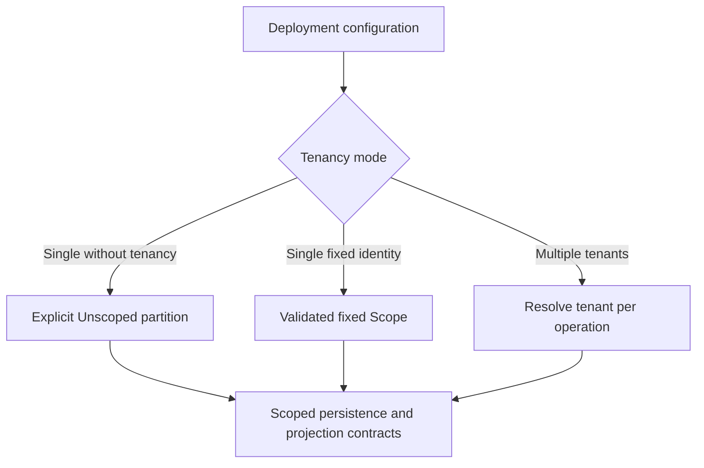
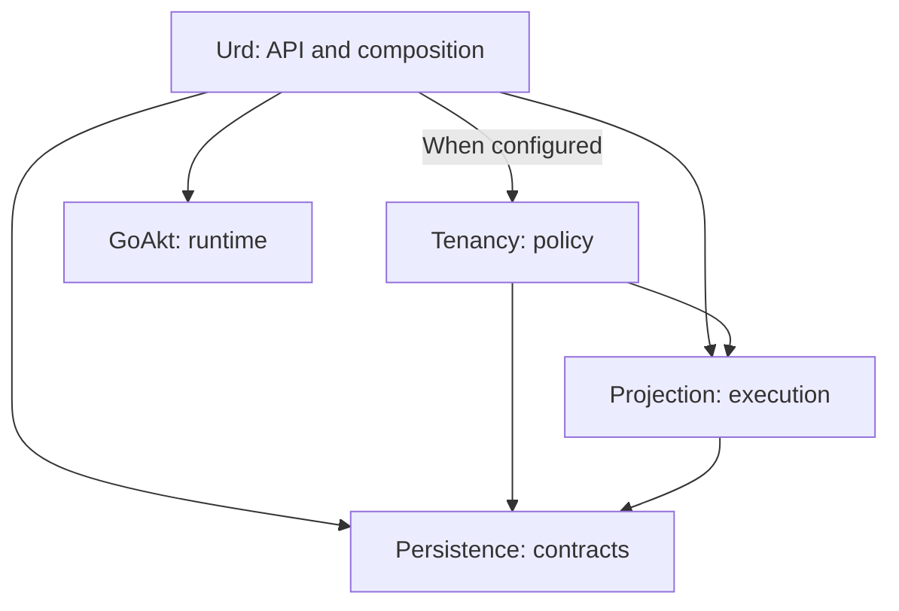
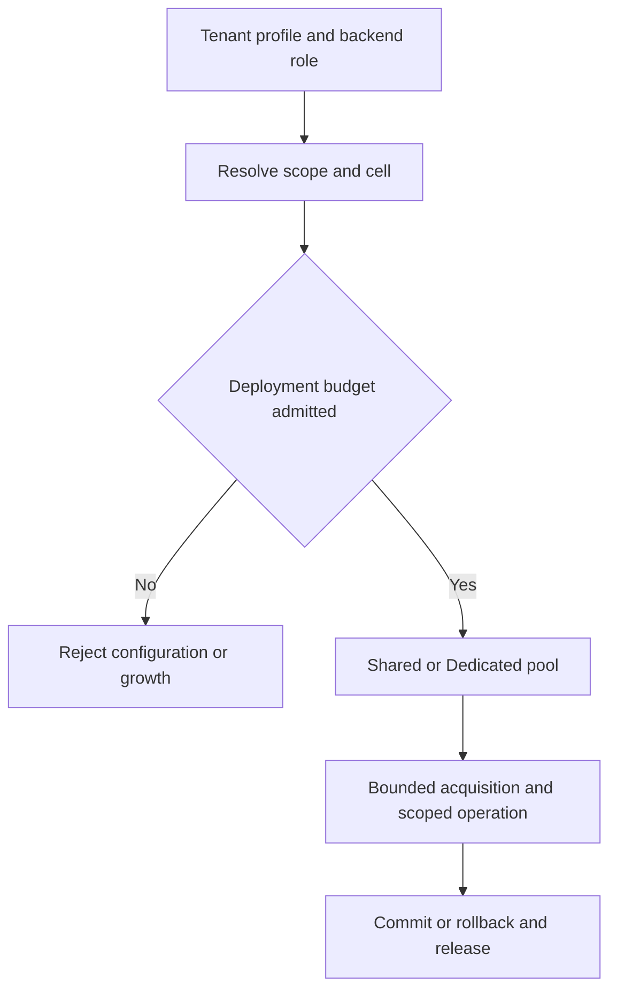
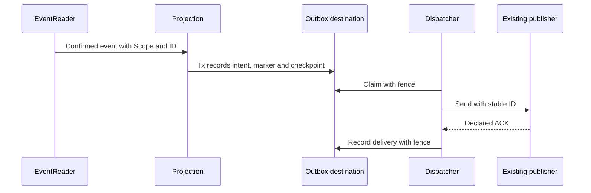
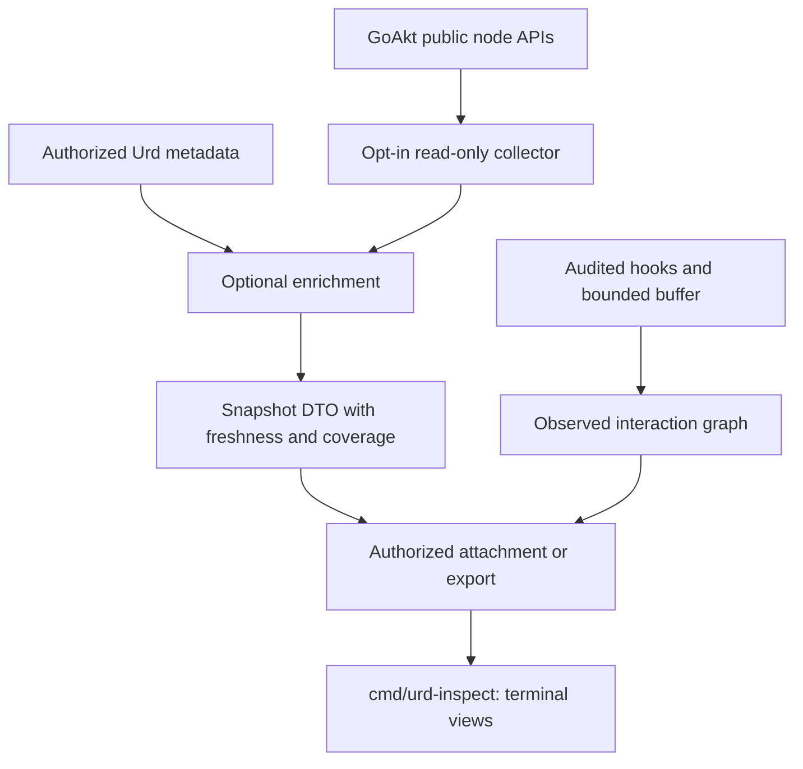

# Urd Platform Product Requirements

- Status: proposal for implementation planning, not a statement of delivered guarantees.
- Date: 2026-10-06.
- Owners: Urd maintainers; prepared jointly by project management and architecture.
- Baseline: `develop` at `80fd2b640cdba4a95b479d653d7943bfebc68ba2`.
- Planning source: the architecture document “Arquitectura de Urd: capas, módulos y responsabilidades” dated 2026-10-06, and the active implementation tracker linked below.

## 1. Product outcome

Urd should let a Go application persist domain decisions, build recoverable read models, and operate either a single tenant or multiple tenants without silent event omissions, uncontrolled queues, or unclear ownership of resources. Application developers should use a coherent programming model over GoAkt; advanced users should be able to consume the public persistence and projection contracts directly.

This work evolves an existing framework. It does not start a replacement implementation. Persistence, durable state, actors, projection code, publishers, sagas, adapters and testkit facilities already have baseline implementations that must be inventoried before they are preserved, migrated or removed. Their presence does not establish that they satisfy the new contracts. [Baseline verification #346](https://github.com/getsyntegrity/urd/issues/346) records the evidence.

The previous roadmap was retired in [#341](https://github.com/getsyntegrity/urd/issues/341). Retirement does not mean its defects were fixed. This PRD does not reactivate archived specifications, translate tracker issues, or approve implementation merely by naming a package. [ADR amendment #347](https://github.com/getsyntegrity/urd/issues/347) must reconcile the proposed boundaries with existing architecture rules.

## 2. Users and representative scenarios

| User | Scenario | Required outcome |
| --- | --- | --- |
| Single-tenant developer | Start an application without tenant identities or a tenant catalog, on one node or a cluster. | Default configuration works with an explicit unscoped partition and preserves existing data; multitenancy remains optional. |
| Backend developer | A command commits, but its response is lost and the client retries. | The same command identity returns the recorded result without emitting another logical decision, within the declared retention window. |
| Read-side developer | Transactions commit out of order, a handler fails, and the worker restarts. | No committed event is silently omitted; entity order, checkpoints and recovery remain explainable. |
| Multitenant operator | One tenant saturates storage access while another uses a contracted resource profile. | Bounded admission and explicit shared or dedicated connection policies prevent unrestricted consumption. |
| Integration developer | The process crashes after a broker accepts a message but before delivery is recorded. | The intent is recoverable; retries keep a stable identity and consumers can deduplicate. |
| Workflow developer | A saga stops while events arrive or a deadline expires. | Durable consumption, state and timers recover; retries and compensation have explicit identities. |
| Operator | A projection is paused, rebuilt, or migrated for one tenant. | Authorized operations remain scoped, auditable and safe under ownership changes. |
| GoAkt/Urd developer | Actors move between nodes and message traffic is hard to understand. | An open source terminal inspector shows observed placement, operational status and sampled interactions with freshness and coverage visible. |

### Supported deployment modes

Single tenancy is a first-class supported deployment model, not a degraded form of multitenancy. The final API names are subject to the ADR; the product supports these three configurations:

| Configuration | Identity and scope | Required composition |
| --- | --- | --- |
| Single tenant without tenancy | No tenant ID is required. Records use `Unscoped()`; reads use `OneScope(Unscoped())`. This is the compatibility default when no tenancy configuration is supplied. | Persistence/projection capabilities used by the application, a trivial default-cell router, and bounded deployment-level resource profiles. A tenancy resolver, tenant catalog and tenancy extension are not mandatory. |
| Single tenant with fixed identity | One validated tenant ID configured at startup maps to a fixed scope. Conflicting explicit identities are rejected. | A fixed binding/provider; dynamic tenant discovery, a catalog and per-tenant routing policies are optional. |
| Multiple tenants | Each operation resolves and validates its tenant; records and progress retain explicit scope isolation. | The configured tenancy services and policies. Missing or invalid identity is rejected where tenancy is enabled. |

Tenancy mode is independent of single-node versus clustered runtime, cell placement, Shared/Dedicated pool access and PerScope/SharedCell processing. PerScope can process `Unscoped()` in a deployment without tenancy. SharedCell is an explicit privileged selection and never follows implicitly from `Unscoped()`.

Single tenancy does not disable application authentication, operational authorization, admission limits or backpressure. Pools are selected by the default scope, cell and backend role when tenancy is absent; connection budgets still include replicas and physical backend capacity. Optional features must remain usable in single-tenant mode without fabricated tenant IDs. In particular, integration/workflow identities include the explicit unscoped or fixed scope, management operates within the configured scope, and actor inspection must not require Urd tenancy merely to inspect a GoAkt deployment.

Keeping a deployment unscoped through the refactor must preserve stored keys, existing streams and snapshots without a new tenant migration. Moving from unscoped data to a fixed or multitenant identity is a separate explicit adoption/migration decision; changing configuration must not silently reassign old data, reinterpret cursors or grant cross-scope access. [Deployment-mode implementation and acceptance #424](https://github.com/getsyntegrity/urd/issues/424) coordinates the core and feature-specific tests.

## 3. Scope and package ownership

The product has eight logical boundaries. During phases 0–2 these are package boundaries within the repository; existing nested adapter/publisher modules are preserved. No new `go.mod` is implied. Optional extraction is a separate phase 3 decision.

| Boundary | Responsibility | Allowed production dependencies | Epic |
| --- | --- | --- | --- |
| Persistence | Journal, snapshots, opaque scopes, logical slices, reader contracts, adapters and conformance. | Runtime/public ports as approved by the ADR; never projection, tenancy or Urd domain. | [#342](https://github.com/getsyntegrity/urd/issues/342) |
| Projection | Reader execution, destination checkpoints, applied markers, preparation, fencing, parking and recovery. | Public persistence contracts; injected codecs and metrics. | [#343](https://github.com/getsyntegrity/urd/issues/343) |
| Tenancy | Optional identity/context, resource profiles, cell routing and tenant lifecycle policies when configured. | Public persistence/projection contracts. | [#344](https://github.com/getsyntegrity/urd/issues/344) |
| Urd | Domain programming model, read-side API, composition and developer experience. | Public contracts of the other boundaries and GoAkt. | [#345](https://github.com/getsyntegrity/urd/issues/345) |
| Integration | Durable integration envelopes, local outbox intents, relay and existing publisher adapters. | Public persistence/projection and existing `port/publishing`; never root Urd. | [#395](https://github.com/getsyntegrity/urd/issues/395) |
| Testkit | Existing testkit extensions, deterministic fakes, fault drivers and integration harnesses. | Public contracts and test utilities; no production package imports testkit. | [#396](https://github.com/getsyntegrity/urd/issues/396) |
| Workflow | Consolidated sagas/processes, durable inbox/state/intents, commands, timers and compensation. | Public persistence/projection and a local `CommandDispatcher` port injected by Urd; never root Urd. | [#397](https://github.com/getsyntegrity/urd/issues/397) |
| Management | Public operational facade, capabilities, authorization, audit and observability. | Public persistence/projection/tenancy control interfaces; Urd composes them. | [#398](https://github.com/getsyntegrity/urd/issues/398) |

Workflow is a Urd proposal informed by actor and event-driven systems; it is not an asserted one-to-one equivalent of an Akka/Lagom module. GoAkt remains responsible for actors, remoting, supervision, placement and runtime extensions. Urd does not duplicate those primitives or require changes to GoAkt.

The following diagram shows only the foundational dependency relationship; additional boundaries follow the table above.

## 4. Functional requirements and acceptance

Requirement IDs provide a stable product reference. Linked issues own implementation detail and evidence; changing a guarantee or boundary requires an explicit decision rather than silently editing a diagram.

### Deployment configuration and compatibility

| ID | Requirement and acceptance | Traceability |
| --- | --- | --- |
| D-01 | Single-tenant unscoped is the default without tenancy configuration; fixed single-tenant and multitenant configurations are explicit. Missing optional tenancy is valid; missing required services or conflicting identities fail during configuration/startup. Node count does not determine tenancy mode. | [#424](https://github.com/getsyntegrity/urd/issues/424), [#383](https://github.com/getsyntegrity/urd/issues/383), [#379](https://github.com/getsyntegrity/urd/issues/379) |
| D-02 | Unscoped compatibility retains existing data identities. Mode changes require explicit adoption/migration; no implicit tenant IDs, wildcard scopes or cursor reuse across identities. Core and available feature tests cover unscoped, fixed and multitenant configurations, including resource limits and authorization. | [#424](https://github.com/getsyntegrity/urd/issues/424), [#349](https://github.com/getsyntegrity/urd/issues/349), [#405](https://github.com/getsyntegrity/urd/issues/405), [#408](https://github.com/getsyntegrity/urd/issues/408) |

### Persistence and projection

| ID | Requirement and acceptance | Traceability |
| --- | --- | --- |
| P-01 | Append checks expected revision, uniqueness and a contiguous batch beginning at revision + 1. Concurrent writers, gaps and overlaps have deterministic conformance cases. | [#354](https://github.com/getsyntegrity/urd/issues/354), [#358](https://github.com/getsyntegrity/urd/issues/358) |
| P-02 | Reads use an explicit selection, opaque validated cursor and stable-prefix contract. Late commits produce zero omissions in the oracle; eligibility and eventual progress are tested separately. No timestamp-only relay/reader is accepted as a correction. | [#348](https://github.com/getsyntegrity/urd/issues/348), [#351](https://github.com/getsyntegrity/urd/issues/351), [#360](https://github.com/getsyntegrity/urd/issues/360) |
| P-03 | Scope is opaque; logical slices are stable independently of node count and physical cell. `Unscoped` means deployment without tenancy, never all tenants. Migration preserves logical identities or explicitly invalidates incompatible cursors. | [#349](https://github.com/getsyntegrity/urd/issues/349), [#350](https://github.com/getsyntegrity/urd/issues/350), [#359](https://github.com/getsyntegrity/urd/issues/359) |
| P-04 | Command dedupe records scope/entity/command identity, payload fingerprint and result in the append transaction. Same-key/different-payload is rejected; successful no-event commands and deterministic domain rejections have specified behavior and retention. | [#357](https://github.com/getsyntegrity/urd/issues/357) |
| R-01 | Checkpoint identity includes mode, scope or cell, processor, projection version and slice. When supported, effect, applied marker and checkpoint commit in one destination transaction, validating the ownership fence. | [#362](https://github.com/getsyntegrity/urd/issues/362), [#373](https://github.com/getsyntegrity/urd/issues/373), [#374](https://github.com/getsyntegrity/urd/issues/374) |
| R-02 | An applied marker never advances over unresolved work. Default permanent-error handling parks the entity; replay uses the current owner and conditional marker. The failed-5/arriving-6-and-7 scenario proves ordered recovery while other entities progress. | [#356](https://github.com/getsyntegrity/urd/issues/356), [#375](https://github.com/getsyntegrity/urd/issues/375) |
| R-03 | Global and range preparation are idempotent and coordinated. Reassignment, restart and a crash during preparation are tested. Rebuild/version cutover uses barriers and pending-work conditions, with retention sufficient for recovery. | [#376](https://github.com/getsyntegrity/urd/issues/376), [#367](https://github.com/getsyntegrity/urd/issues/367), [#370](https://github.com/getsyntegrity/urd/issues/370) |

Snapshots and durable state are distinct models. The baseline `StateStore` path must be inventoried in P-01/P-04 planning before code is moved or removed; this PRD does not invent an already-complete durable-state migration. Event/snapshot evolution, existing codecs and historical-data compatibility likewise require a recorded preservation or follow-up decision in #346.

#### Reader and processing contract

A stable prefix means that after returning cursor `c`, no event at a position ≤`c` can become visible later for the accepted selection and range. `OneScope` reads one scope; `AllScopesInCell` is an explicitly privileged selection. PerScope checkpoints use scope/processor/version/slice identity; SharedCell checkpoints use cell/processor/version/slice identity. Opaque cursors carry format version, cell and selection fingerprint and validate slice-range compatibility; incompatible reuse returns `ErrCursorMismatch` or its final approved equivalent.

An applied marker is `(processor, version, scope, entity) → lastSeqNr`. Progress is eventual under stated conditions: transactions terminate, processing capacity is greater than zero, and failed work is successfully retried, its entity parked, or an operator explicitly records an audited skip. It is not a latency bound. Transient failures retry in place with backoff. Permanent failures default to parking; exceeding the configured parked-entity ceiling stops the range rather than growing state indefinitely. A manual skip is an explicit, audited acceptance of a missing effect, not silent advancement.

Version cutover pauses the old processor and records its per-slice barrier. The pointer-switch transaction validates new offsets against those barriers and the pending-work condition. By default the new version cannot introduce parked entities absent from the old version's barrier state; otherwise activation requires an explicit audited decision. Checking offsets outside the pointer transaction is insufficient.

### Tenancy, pools and composition

| ID | Requirement and acceptance | Traceability |
| --- | --- | --- |
| T-01 | When tenancy is configured, tenant identity is extracted, propagated and validated across commands, events and queries; unscoped single-tenant operation does not require a tenant identity. Scope/cursor validation and authorization reject cross-tenant access; privileged cell-wide selection is explicit. | [#379](https://github.com/getsyntegrity/urd/issues/379), [#368](https://github.com/getsyntegrity/urd/issues/368) |
| T-02 | Rebuild, cell migration and deletion operate on the intended tenant without resetting shared checkpoints or affecting another tenant. Inventory recovery data, snapshots, command IDs and later workflow/outbox state. | [#381](https://github.com/getsyntegrity/urd/issues/381), [#369](https://github.com/getsyntegrity/urd/issues/369), [#382](https://github.com/getsyntegrity/urd/issues/382) |
| C-01 | Shared access has finite operations and waiters per pool, with generic per-scope admission; tenancy supplies the profile. Cancellation releases permits, full queues reject immediately and metrics distinguish occupancy, wait and rejection. | [#378](https://github.com/getsyntegrity/urd/issues/378), [#380](https://github.com/getsyntegrity/urd/issues/380) |
| C-02 | Resource selection separates scope, cell, backend and role. Journal/feed and projection destination are independent resources. Shared/Dedicated is an access policy; DedicatedCell combines cell location and exclusive access. | [#390](https://github.com/getsyntegrity/urd/issues/390), [#368](https://github.com/getsyntegrity/urd/issues/368) |
| C-03 | Dedicated pools have finite maxima, admitted reservations and bounded lazy creation. No silent fallback or lending to another tenant. Concurrent creation, failed creation, eviction, credential rotation and shutdown preserve active transactions and release resources. | [#392](https://github.com/getsyntegrity/urd/issues/392) |
| C-04 | Deployment validation sums pool maxima by physical backend and replica maximum, including overlapping rolling-update instances, headroom and planned external clients. Over-allocation or unbounded growth is rejected before activation. V1 uses static budgets, not an invented distributed lease coordinator. | [#391](https://github.com/getsyntegrity/urd/issues/391), [#384](https://github.com/getsyntegrity/urd/issues/384) |
| C-05 | SharedCell may use different tenant pools against a coherent transaction destination. V1 rejects independent destinations under one shared checkpoint. Pool selection happens before a transaction; rollback or saturation never advances progress. | [#393](https://github.com/getsyntegrity/urd/issues/393) |
| U-01 | Compile-time adapters/services register through GoAkt extensions and resolve in `PreStart`; tenancy is required only for the configured identity/policy capabilities. Minimum capabilities are validated per journal/feed/destination role. ReadSideProcessor exposes identity, version, mode, preparation and a tenant-visible envelope with the destination transaction. | [#383](https://github.com/getsyntegrity/urd/issues/383), [#384](https://github.com/getsyntegrity/urd/issues/384), [#366](https://github.com/getsyntegrity/urd/issues/366) |

A dedicated pool isolates connection access, not CPU, disk, locks or a shared database horizon. A maximum is a consumption ceiling; an admitted minimum is a budget reservation, with connection warming specified separately. Neither guarantees availability during outage/reconnection. Identity includes a credential identity/version without exposing secrets. Transactions require explicit commit/rollback even after cancellation. Ownership must distinguish borrowed consumer-managed stores from newly owned registry resources; an actor stopping must not close a pool used by other actors. These conditions are verified by [#394](https://github.com/getsyntegrity/urd/issues/394).

Journal capabilities require conditional contiguous append, entity-stream reads, uniqueness and declared command dedupe. Feed capabilities require declared stable-prefix/eligibility and durable validated cursors. A destination requires a common transaction or an explicitly declared idempotent-upsert strategy, with fencing for multiple executors. Memory/testkit and PostgreSQL are the initial adapters; unsupported combinations are rejected by composition.

### Integration, testkit and workflow

| ID | Requirement and acceptance | Traceability |
| --- | --- | --- |
| I-01 | Integration envelopes have stable producer/scope/source-event-or-command/output-key-or-ordinal identities, version and causation. Multiple outputs/producers do not collide; rebuild/version changes cannot accidentally republish delivered events. | [#399](https://github.com/getsyntegrity/urd/issues/399), [#400](https://github.com/getsyntegrity/urd/issues/400) |
| I-02 | A confirmed journal event is consumed by the existing reader/runner; destination Tx records intent, applied marker and checkpoint together. The relay uses fencing, bounded polling/retries and declared publisher ACK before recording delivery. Crash after ACK may duplicate delivery and keeps the same ID. | [#400](https://github.com/getsyntegrity/urd/issues/400), [#401](https://github.com/getsyntegrity/urd/issues/401) |
| I-03 | Existing publisher adapters declare their real ACK/failure capabilities. Lifecycle tests cover duplicate delivery, noisy tenants, retention and coordinated migration/deletion of pending intents. No broker deployment is added. | [#402](https://github.com/getsyntegrity/urd/issues/402), [#403](https://github.com/getsyntegrity/urd/issues/403) |
| K-01 | Extend existing testkit rather than copying TCK. Fakes, clocks and fault drivers provide reproducible commit, fence, parking, cancellation and pool scenarios in unscoped, fixed and multitenant configurations without real resources in unit tests. | [#404](https://github.com/getsyntegrity/urd/issues/404), [#405](https://github.com/getsyntegrity/urd/issues/405), [#406](https://github.com/getsyntegrity/urd/issues/406) |
| K-02 | A reusable PostgreSQL testcontainers harness provides real integration evidence with isolated fixtures and reliable teardown. Product drivers test PerScope/SharedCell and offer optional outbox/workflow scenarios without making future implementations mandatory dependencies. | [#407](https://github.com/getsyntegrity/urd/issues/407), [#408](https://github.com/getsyntegrity/urd/issues/408) |
| W-01 | Consolidate existing sagas with scope/workflow/version identity and durable consumption. State, inbox dedupe, command intent and checkpoint use the compatible destination Tx; no independent journal runner or import of root Urd. | [#409](https://github.com/getsyntegrity/urd/issues/409), [#410](https://github.com/getsyntegrity/urd/issues/410) |
| W-02 | CommandDispatcher delivers at least once using stable command IDs; compensation uses its own stable identity. Timers persist expiry and use CAS/version/fence against cancel/reprogram/fire races. Recovery tests cover events during downtime, uncertain outcomes and restart during compensation. | [#411](https://github.com/getsyntegrity/urd/issues/411), [#412](https://github.com/getsyntegrity/urd/issues/412), [#413](https://github.com/getsyntegrity/urd/issues/413) |

External effects are not transactionally rolled back by compensation. Journal append and outbox intent are not assumed atomic across independent backends. Notifications only improve latency; polling and durable state remain the recovery source.

### Management and actor inspector

| ID | Requirement and acceptance | Traceability |
| --- | --- | --- |
| M-01 | A public control SPI identifies operation, scope/cell, processor/version/range and capability. Status exposes committed progress, ownership, parked work and backend-role resources, distinguishing unavailable, stale and incomplete data. | [#414](https://github.com/getsyntegrity/urd/issues/414), [#415](https://github.com/getsyntegrity/urd/issues/415) |
| M-02 | Durable pause/resume primitives live in projection; management is the guarded facade. All enabled mutations pass authorization, dedupe, audit and fencing. Replay/rebuild/version change/migration/delete delegate to existing owners and only enable when capabilities exist. | [#416](https://github.com/getsyntegrity/urd/issues/416), [#417](https://github.com/getsyntegrity/urd/issues/417), [#418](https://github.com/getsyntegrity/urd/issues/418) |
| A-01 | Audit the repository's actual GoAkt version/fork before implementing a read-only collector. Generic DTO/source supports GoAkt without Urd domain/tenancy imports; Urd enrichment is separately authorized and optional. Operational state never implies arbitrary domain-state introspection. | [#419](https://github.com/getsyntegrity/urd/issues/419) |
| A-02 | Standalone `cmd/urd-inspect` has an explicit authorized attachment/export channel. Snapshot/replay is identified as such; live mode requires real periodic snapshots or a live channel. Placement/topology/status include timestamp, node provenance, freshness and coverage. | [#419](https://github.com/getsyntegrity/urd/issues/419), [#421](https://github.com/getsyntegrity/urd/issues/421) |
| A-03 | Interaction graphs contain only observations available through audited hooks. Sampling, buffers, aggregation and refresh are bounded; drops and observation windows are shown. Payload capture is off by default. Queries/attachment fail closed on missing authorization. | [#420](https://github.com/getsyntegrity/urd/issues/420), [#419](https://github.com/getsyntegrity/urd/issues/419) |
| A-04 | The portable terminal console provides actor lists, location, operational status, topology and observed interactions; it has no kill/restart controls. Tool/dependency licenses are compatible with the repository and no paid telemetry backend is required. Restart/staleness/drops/tenant isolation and overhead are tested. | [#421](https://github.com/getsyntegrity/urd/issues/421), [#422](https://github.com/getsyntegrity/urd/issues/422) |

The inspector initially belongs to Urd, with a reusable GoAkt core and an optional domain adapter. Future GoAkt adoption is a proposal contingent on evidence, compatibility and maintainer interest; there is no endorsement, owner contact or automatic promotion in scope. The console is inspired by actor tooling as a category, without promising parity with an unidentified Akka product. Parent/child and placement snapshots are best effort, and sampled edges are not a complete causal map.

## 5. Non-functional requirements and measurement

Correctness evidence is required before capacity claims. No throughput, SLA or production latency target is demonstrated by this document. [#355](https://github.com/getsyntegrity/urd/issues/355) defines workload units, payload distribution, events per command, entity/tenant skew, projection count/cost, hardware and observation windows.

| Measure | Acceptance policy |
| --- | --- |
| Committed-event omissions | Zero in the conformance oracle under the stated contract. |
| Late commits, duplication and obsolete ownership | Reproducible fault evidence; no silent effect loss, unauthorized write or checkpoint advance. |
| Eligibility and processing lag | Report separately; application latency includes eligibility, queueing and handler cost. |
| Admission and resource use | Finite entry/mailbox/stash/pool/batch/telemetry limits; record rejection rates, waiters, memory and recovery. |
| Sustained capacity | Define a reproducible workload and measure writes together with all planned projections; report accepted/rejected work with latency. |
| Recovery | Measure backlog drainage after overload; required spare capacity and target duration are agreed in #355, not assumed. |
| Inspector overhead | Fix actor count/event rate and report CPU, memory, observation coverage and drops; collector failure does not take down the application. |

Architecture-source examples such as p99 write confirmation ≤50 ms, application latency ≤1 s, one-hour sustained load, a 2× two-minute burst and recovery ≤5 minutes are provisional experiment inputs, not accepted service commitments. [Gate A #387](https://github.com/getsyntegrity/urd/issues/387) owns mechanism selection and experiment criteria; [#385](https://github.com/getsyntegrity/urd/issues/385) owns overload/recovery evidence. Limits that remain include serial hot entities and the measured capacity of one physical cell per tenant.

Gate A's proposed experiment checks zero omissions, progress and conditional eligibility ≤`T`; hot-shard throughput at least 80% of the recorded control; and experimental p99 ≤`transaction_timeout + 1 s` with a long transaction in another database. The workload, comparator, dedicated hardware and operating conditions must be recorded. These figures are provisional mechanism-acceptance criteria from #352/#387, not a service SLA or achieved benchmark. Overload evidence must also show accepted/rejected work and recovery under the agreed workload.

If xid8 is selected, its proposed eligibility bound requires a dedicated PostgreSQL cluster per cell, `transaction_timeout` for every role that can write, including administrative roles, `max_prepared_transactions = 0`, and an oldest-XID alert. The experiment must validate those conditions. If they are violated, the stable-prefix safety requirement remains, but bounded eligibility is not claimed. A request-context timeout alone does not enforce these database conditions, and database transaction timeout can terminate the connection.

Metrics use bounded dimensions such as cell, backend role, access policy and class; tenant dimensions are controlled opt-in. Credentials/DSNs and sensitive payloads are excluded. Logical query isolation, connection admission and privileged inspection are separate controls.

## 6. Phased roadmap and release acceptance

The [module separation implementation plan](urd-module-separation-plan.md) maps the existing gates and tracker dependencies to internal package changes and optional publication. It is a dated planning snapshot, not ADR approval or evidence that a gate has passed. Internal regrouping such as #365 does not create new Go modules; independent extraction remains phase 3.

| Stage | Deliverable | Exit evidence |
| --- | --- | --- |
| Phase 0 | Baseline audit, ADR, explicit tenancy modes, reader/scope/slice/checkpoint/command contracts, resource selection and workload model. | Verified baseline and explicit unresolved decisions; [#346](https://github.com/getsyntegrity/urd/issues/346), [#347](https://github.com/getsyntegrity/urd/issues/347), [#390](https://github.com/getsyntegrity/urd/issues/390). |
| Gate A | Select the reader mechanism before committing the new reader schema. | [#387](https://github.com/getsyntegrity/urd/issues/387): omission, eligibility/progress and measured mechanism comparison; xid8 remains a candidate. |
| Phase 1 | Internal persistence/projection correctness, Shared admission, dependency checks and core testkit/harness. | TCK, migrations and bounded-resource evidence; internal package regrouping without new independent Go modules. |
| Gate B | Verify the core under conformance and injected faults. | [#388](https://github.com/getsyntegrity/urd/issues/388). Phase-2 public read-side drivers and later features do not become circular prerequisites. |
| Phase 2, high priority | Urd read-side, tenancy lifecycle/resource profiles, Dedicated pools, integration and product testkit. | Linked feature acceptance, compatibility and operational evidence. Integration/testkit have priority P1; existing core tracker priorities are preserved. |
| Phase 2, later | Workflow consolidation, management facade and temporary actor inspector. | Priority P3 and capability-specific evidence; no artificial requirement to finish every later feature for the core gates. |
| Gate C | Assess SPI stability and independent consumers in real use. | [#389](https://github.com/getsyntegrity/urd/issues/389); later features are reviewed when they affect the SPI, not blanket completion prerequisites. |
| Phase 3, optional | Extract/publish independent modules only where justified. | [#372](https://github.com/getsyntegrity/urd/issues/372): compatible published dependencies, no temporary GoAkt fork replace, conformance and versioning; tenancy needs another consumer. |

Architecture tests [#353](https://github.com/getsyntegrity/urd/issues/353) enforce approved imports and documented temporary exceptions. Unit tests use mocks/fakes and never call real databases or APIs. PostgreSQL/testcontainers, cluster and failure/load tests belong to explicit integration lanes. Existing code is retained or migrated based on inventory; archived specifications are not an active implementation source. [#386](https://github.com/getsyntegrity/urd/issues/386) gathers examples as capabilities become available without blocking the core guide on every later feature.

Gate B evidence covers single-tenant unscoped/fixed compatibility and the configured multitenant path in memory/testkit and PostgreSQL conformance, with injected failures for scope isolation, valid/mismatched cursors, contiguous append, command idempotency, transaction rollback/crash/dedupe, parking/replay and obsolete fencing. Passing fake scenarios alone is not proof of PostgreSQL behavior. Gate C does not require contacting maintainers.

## 7. Non-goals and guarantee boundaries

- Global or causal ordering between entities; exactly-once delivery to brokers/services; distributed transactions across independent destinations.
- Guaranteed application latency under arbitrary load, infinite queues, or unmeasured million-requests-per-second claims.
- Treating a dedicated connection pool as physical database isolation or guaranteed availability during outages.
- Sharding one tenant across several cells before a concrete need and cursor/routing design are established.
- New Oracle/Cassandra/Kafka/NATS storage backends, broker deployment, external-consumer framework, dynamic plugin loading, or a new HTTP/gRPC/dashboard product.
- Duplicating actor/runtime primitives, changing GoAkt as a prerequisite, arbitrary domain-memory reflection, or mutating actors from the inspector.
- Automatically extracting packages, publishing releases, merging code, contacting maintainers, or obtaining endorsement through this PRD.

## 8. Risks and decisions requiring evidence

| Risk or decision | Required resolution |
| --- | --- |
| Reader mechanism may couple eligibility across a physical PostgreSQL cluster. | Compare xid8 and alternatives in [#352](https://github.com/getsyntegrity/urd/issues/352). If xid8 is selected, document all writer-role timeouts, prepared-transaction constraints, old-XID alerts and the consequence of violating those conditions. No eligibility bound is assumed without them. |
| Schema/slice/checkpoint changes may strand existing data. | Validate upgrades from the current schema and record cursor invalidation/cutover in #359/#362; choose slice count and mapping explicitly. |
| Dedicated pool catalog or replica growth can over-allocate the backend. | Static budget, bounded catalog, rolling-update reserve and rejection in #391; dynamic global admission requires a future ADR. |
| SharedCell may hide incompatible destinations. | Enforce coherent destination identity in #384/#393; reject independent destinations with shared checkpoints until a separate checkpoint/aggregation design exists. |
| Relay crashes, rebuilds or multiple producers cause duplicates/collisions. | Producer/output-aware stable identities, ACK capability and explicit replay/publication policy in #399–#403. |
| Existing unscoped data, durable state, payload evolution or saga behavior can be lost during refactor. | Baseline preservation inventory in #346, mode compatibility in #424, explicit data adoption/migration and targeted follow-up rather than deletion or reassignment by assumption. |
| GoAkt fork APIs differ from current public documentation. | #419 audits the effective pinned version/replace and cancellation/remote behavior; report unsupported data instead of guessing. |
| Inspector attachment or telemetry leaks data or overloads the process. | Opt-in authorized channel, fail-closed permissions, redaction, bounded observation and failure isolation in #419–#422. |
| Freeze/extraction precedes evidence or new boundaries contradict the ADR. | #347/#353 reconcile rules; Gate C and optional phase 3 decide independently from package naming. |

Remaining product decisions include the measured workload/SLOs, slice count, error/parking ceilings, command-ID retention, minimum resource profiles, publisher ACK semantics, and the concrete live inspector attachment. Each must be recorded in its linked issue/ADR before its guarantee is claimed. This PRD sets the product scope and acceptance relationship; it does not replace those decisions with assumptions.
